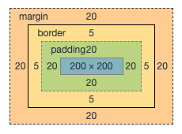
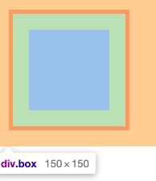
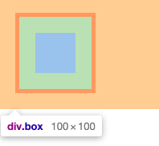
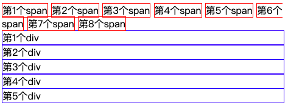
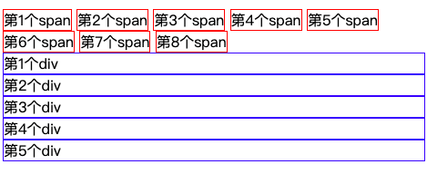
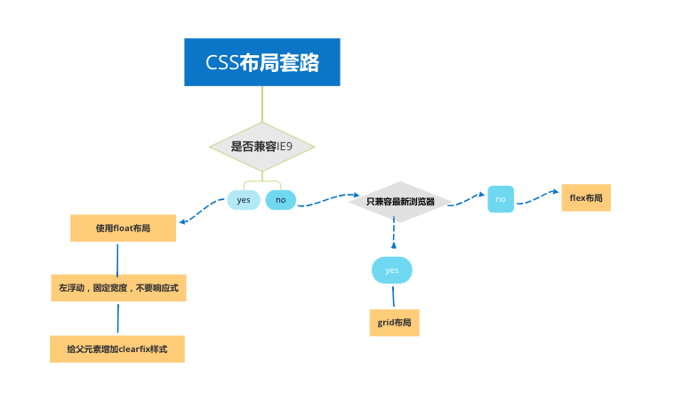

## CSS 全解

如果我们把 `HTML` 理解为一栋房子的主体结构（毛坯房），那么 `CSS` 就是我们用来装修房子的材料，我们可以用 `CSS` 装修出各种华丽、大体、美观的房子（网页）。所以 `CSS` 对于前端开发者来说也是必不可缺的一项软技能了，学好 `CSS` 就显得尤为重要了。废话不多说一起来看看 `CSS` 的一些重要知识点吧。

### CSS 盒模型

`CSS` 盒模型是 `CSS` 的基础，也是我们在工作中会经常遗忘的点，基本上面试时都会被提及，那么什么是 `CSS` 盒模型呢？一起来看。

我们知道网页是由 `html` 标签组成的，我们可以认为每个 `html` 标签都是一个小方块，小方块里面又套着小方块，就像是盒子一层层包裹一样，这就是所谓的盒模型了。也可以理解为一个小模块就具备一个盒模型。

#### 盒模型的组成

盒模型是由外边距(margin)、边框（border）、内边距（padding）、内容（content）组成的，如下图：



上图就是一个基本的 `CSS` 盒模型的构成。

盒模型又可分为  **内容盒模型(content-box)** 和 **边框盒模型(border-box)** 。其中内容盒模型是浏览器默认的解析的盒模型。它们有什么区别呢？

1. content-box 宽度组成 , 如下代码：

```css
.content-box {
  width: 100px;
  height: 100px;
  padding: 20px;
  border: 5px solid #f00;
  margin: 20px;
  box-sizing: content-box;
}
/*浏览器解析出来的宽度为 width + padding + border */
```

图解上述代码：



2. border-box 宽度组成，如下代码：

```css
.content-box {
  width: 100px;
  height: 100px;
  padding: 20px;
  border: 5px solid #f00;
  margin: 20px;
  box-sizing: border-box;
}
/*浏览器解析出来的宽度为，宽度写了多少就是多少，padding 与 border 会解析在写的width里 */
```

图解上述代码



高度跟宽度原理同理，只需要把左右换为上下即可。两个盒子模型的切换可以通过 `css` 属性 `box-sizing` 来修改。

**注意：盒子模型的宽度是由 `padding` 、`border`、`content(内容)` 构成的，其并不包含 `margin`大小。但是 `css` 盒模型是由 `content(内容)`、`padding(内边距)`、`border（边框）`、`margin(外边距)`组成的 ；**

在现代布局中，通常是会把 `box-sizing` 设置为 `border-box` 方便我们进行宽度计算这样不会造成宽度错乱问题。

### CSS margin合并问题

关于 `margin` 合并问题可以参照我写的这篇文章 [css-margin布局技巧]([https://jinchao1992.github.io/post/css-margin-%E5%B8%83%E5%B1%80%E6%8A%80%E5%B7%A7/](https://jinchao1992.github.io/post/css-margin-布局技巧/)) 这里就不列举了！

### 页面文档流

文档流（英文名：Normal Flow）简单来说就是文档流动方向。内联元素从左向右流动，走到行尾进行折行继续走，块级元素从上到下排列，一行只有一个块级元素。如下图：



可以看到内联元素遇到行尾之后会自动折行，块级元素不管设置宽度多少是一定会独占一行的。

#### 模块元素

* `inline` 内联元素，从左向右流动，会自动折行，如果一行放不下的话会把行尾的内联元素切分，如上图所示。

* `block` 块元素，从上到下流动，不管宽度多大只要是块就会一直独占一行。

* `inline-block` 内联块元素，从左到右流动，但是又具备块级元素的特性。如果在一行的行尾放不下时，元素会整体下移。如下图：

  

如上图所示，我们把 `span` 变为了内联块，在行尾时第6个 `span` 是换行显示的。

**注意：HTML模块并不是只有这三种，只是我们可以通过修改css样式变为这三种模块； 内联元素里不能加入块级元素**

#### 宽度

* 内联元素的宽度是由元素本身里内联元素的宽决定的，不能用 `width` 设置；
* 块级元素的默认宽度是 `auto`；表示能有多宽占多宽，块级元素宽度最好别写 `100%`；
* 内联块元素的宽度跟内联元素一样，但是可以使用 `width` 进行设置；

#### 高度

* 内联元素的高度是由 `line-height` 行高间接确定，跟 `height` 无关，跟字体有关系；
* 块级元素的高度是由里面所有**文档流元素**的高度总和决定的；一定注意是文档流元素，因为一个一旦脱离文档流就会造成高度塌陷。也可以通过 `height` 设置高度。
* 内联块跟块级元素一样，可以设置高度；

#### 文档溢出（overflow）

* overflow: visible; 默认写法 超出文档内容默认显示
* overflow: hidden; 超出文档内容隐藏
* overflow: scroll; 超出部分用滚动条显示，但是如果不超出也会显示滚动条
* overflow: auto; 超出部分自动选择滚动条

注意：如果有滚动条，内联元素默认在第一屏显示（特指overflow-x 方向）`overflow` 可以分为 `overflow-x` 与 `overflow-y`。

### 脱离文档流

* 浮动元素可以脱离文档里；

  ```css
  .box {
    float: left; /* 或者float:right */
  }
  ```

  

* 绝对定位元素与固定定位元素可以脱离文档流；

  ```css
  .box {
    position: absolute; /*或者position: fixed;*/
  }
  ```

脱离文档流后会造成高度塌陷，为什么呢？因为块级元素的高度是由里文档流元素决定的。

### 布局分类

布局是什么？布局的定义是，把页面分为一个个模块，并按照一定的格式组合排列，这就是布局。

布局大致可以分为三类：

* 固定宽度布局，一般宽度为 960/1000/1024/1200px等；
* 不固定宽度布局，依靠文档流来实现；
* 响应式布局，具体就是两套页面PC上固定宽度，手机上不固定宽度，称之为混合布局。

### CSS 布局套路

用下图可以简单表示：



如果我们只做手机移动页面或者只兼容高级浏览器的话，可以直接使用 `flex` 布局。

#### float 布局

在现代浏览器中，`float`  布局显得不是那么重要了，因为可以通过 `flex` 或者 `grid` 写很少的代码就可以达到很复杂的布局，但是呢？因为存在浏览器兼容的问题，如必须兼容到 `IE8` 等，还是得用 `float` 布局。

##### float 布局步骤

* 在子元素上加上 `float:left;` 或 `float:right;` 并添加 `width`；
* 重点： 在父元素上添加 `.clearfix` 类 用来清除浮动，因为不清除浮动会造成很大 `bug`;

```html
<style>
 .clearfix:after {
    content: '';
    display: block;
    clear: both;
  }
  .parent {
    border: 1px solid red;
  }
  .child {
    float: left;
  }
  .child:nth-child(1) {
    width: 100px;
    border: 3px solid blue;
  }
  .child:nth-child(2) {
    border: 3px solid green;
    float: right;
  } 
</style>
<div class="parent clearfix">
  <div class="child">left</div>
  <div class="child">rigth</div>
</div>
```

注意：通常最后一个 `float` 元素不添加宽度，让其自动响应；`display: inline-block;`元素需加上 `vertical-align:top`;

##### float 布局示例

* 两栏布局  [demo](https://jsbin.com/xuruceh/3/edit?html,css,output)
* 三栏布局 [demo](https://jsbin.com/xuruceh/19/edit?html,css,output)
* 平均布局 [demo](https://jsbin.com/xuruceh/24/edit?html,css,output)

#### flex 布局

移动互联网时代浮动布局是用的越来越少，紧接着出现的是 `flex` 布局与 `grid` 布局，由于 `grid` 布局本身的兼容性不是太好，所有目前用的最多的还是 `flex` 布局。一起来看 `flex` 布局是什么吧！

`flex`  作用在两个模块身上，分别是 `container`(容器)  与 `items`(子元素) 如下图：


##### flex container 样式

* `display:flex` 元素变为弹性盒；
* `flex-direction: row | row-reverse | column | column-reverse` 改变子元素流动方向（控制的方向叫主轴）
  * `row` 默认样式，子元素横向排列  [demo](https://jsbin.com/xisopis/1/edit?html,css,output)
  * `row-reverse` 子元素从右往左排 [demo](https://jsbin.com/xisopis/4/edit?html,css,output)
  * `column` 子元素竖着排列 [demo](https://jsbin.com/xisopis/5/edit?html,css,output)
  * `column-reverse` 子元素从下往上排列 [demo](https://jsbin.com/xisopis/19/edit?html,css,output)

* `flex-wrap: nowrap | wrap | wrap-reverse` 控制子元素流动是否折行
  * `nowrap` 默认样式，不折行，如果子元素过多则会一直去平分父元素宽度 [demo](https://jsbin.com/xisopis/18/edit?html,css,output)
  * `wrap` 换行 [demo](https://jsbin.com/xisopis/17/edit?html,css,output)
  * `wrap-reverse` 从下往上折行 [demo](https://jsbin.com/xisopis/15/edit?html,css,output)

* `justify-content: flex-start | flex-end | center | sapce-between | space-around | space-evenly` 设置主轴对齐方式
  * `flex-start` 默认样式，开始位置对齐 
  * `flex-end` 结束位置对齐 [demo](https://jsbin.com/xisopis/21/edit?html,css,output)
  * `center` 居中对齐（非常有用）[demo](https://jsbin.com/xisopis/22/edit?html,css,output)
  * `space-between` 富裕空间放入两个元素之间 [demo](https://jsbin.com/xisopis/23/edit?html,css,output)
  * `space-arount` 富裕空间平均放入在每个元素之间 [demo](https://jsbin.com/xisopis/26/edit?html,css,output)
  * `space-evenly` 在一个元素与最后一个元素的留白是一样的，其余元素平分 [demo](https://jsbin.com/xisopis/28/edit?html,css,output)

* `align-items: flex-start | flex-end | center | stretch ` 规定侧轴的对齐方式

  * `flex-start` 默认样式，开始位置对齐
  * `flex-end` 结束位置对齐 [demo](https://jsbin.com/xisopis/30/edit?html,css,output)

  * `center` 侧轴居中对齐 [demo](https://jsbin.com/xisopis/31/edit?html,css,output)

  * `stretch` 默认，侧轴两边对齐，如果子元素内容不一致时则会默认对齐最长的元素 [demo](https://jsbin.com/xisopis/34/edit?html,css,output)

* `align-content: flex-start | flex-end | center | space-between | space-around | stretch`  多行内容对齐方式

  * `flex-start` 整体靠上 [demo](https://jsbin.com/xisopis/36/edit?html,css,output)

  * `flex-end` 整体靠下  [demo](https://jsbin.com/xisopis/38/edit?html,css,output)
  * `center` 整体居中 [demo](https://jsbin.com/xisopis/40/edit?html,css,output)
  * `space-between`  富裕空间在每一行中间 [demo](https://jsbin.com/xisopis/42/edit?html,css,output)

  * `space-around` 富裕空间在每一行的两侧，平均分配 [demo](https://jsbin.com/xisopis/43/edit?html,css,output)

##### flex item 样式

* `order` 排序，子元素的 `order`默认是 0 设置值之后为从小到大排列，设置的越大就会排列到最后面，可以为负值，如果值相同的话按照 DOM 书写前后顺序排列 [demo](https://jsbin.com/xisopis/48/edit?html,css,output)
* `flex-grow` 用来分配多余的空间给某个元素默认是 0  [demo](https://jsbin.com/xisopis/50/edit?html,css,output)
* `flex-shrink` 用来处理空间不够时规定哪个元素缩小尺寸，默认是 1 ，注意：子元素必须是在同一行时才会起作用  [demo](https://jsbin.com/xisopis/52/edit?html,css,output)
* `align-slef: flex-start | flex-end...` 规定单个元素的对齐位置，如果在父级元素身上设置了侧轴对齐方式，`align-self` 可以单独的规定某一个元素的侧轴对齐 