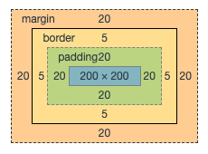
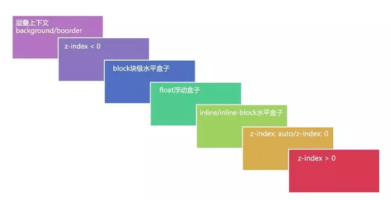

## 前言

思考一个小问题，布局与定位的区别？

我们可能认为布局里面也是包含定位的，因为布局时一个个小模块组合在一块的，而定位也是把一个模块通过定位的方式放在一个模块里。其实不然，**布局是相对于屏幕平面上的，而定位是垂直于屏幕上的。** 那么这是什么意思呢？里面有涉及哪些概念呢？下面一起看看吧！

## div的分层

之前我们有提到过盒模型的概念，如下图：



假如给内容区一个背景，那么背景的范围是从哪里开始的呢？通过一个 [验证demo](https://jsbin.com/givazajuye/2/edit?html,css,output) 可以得出背景色的区域是 `border` 外边沿围城的区域。那么通过这个例子可以知道一个模块的背景色是低于一个模块的 `border` 的，模块的具体分层是什么样子呢？如下图所示：


从上图例子可以看出来，一个模块的分层是从下往上的是 `background`、`border` 、`块级子元素`、`浮动元素` 、`内联元素`。可以通过 [在线demo](https://jsbin.com/hinariqiha/2/edit?html,css,output) 进行验证。验证图如下：


**注意：文字模块，如果是后写的层级是会覆盖前者的，不管是 `浮动元素` 还是 `内联元素`。**

## 定位 position

* `static` 默认值，当前元素在文档流中；
* `relative` 相对定位，元素也是在文档流之内，可以通过设置 `top/right/bottom/left` 值进行位置的偏移，但是始终是占据着文档流的，一般作为 `absolute` 的父级使用。
* `absolute` 绝对定位，脱离文档流，使用场景，比如：对话框、比如二级导航等，`absolute` 是相对于祖先元素中最近的**定位元素（除样式是`static`以外的元素）**。在使用绝对定位时，一定要给父级添加上 `relative` ；
* `fixed` 相对于视口进行定位，如：回到顶部按钮、网页右侧固定广告栏等；移动端上尽量不要使用`fixed` ，场景：如果给元素添加 `transform:scale(1.1)` 那么就不会相对于视口定位。

注意：定位元素可以添加 `z-index` 来确定定位元素的层级，`z-index` 的默认值是 `auto` 可以设置为正整数和负整数以及 `0` ；

## 层叠上下文、层叠等级、以及层叠顺序

### 什么是层叠上下文？

> 层叠上下文(stacking context)，是HTML中一个三维的概念。在CSS2.1规范中，每个盒模型的位置是三维的，分别是平面画布上的`X轴`，`Y轴`以及表示层叠的`Z轴`。一般情况下，元素在页面上沿`X轴Y轴`平铺，我们察觉不到它们在`Z轴`上的层叠关系。而一旦元素发生堆叠，这时就能发现某个元素可能覆盖了另一个元素或者被另一个元素覆盖。
>
> 如果一个元素含有层叠上下文，(也就是说它是层叠上下文元素)，我们可以理解为这个元素在`Z轴`上就“高人一等”，最终表现就是它离屏幕观察者更近。

### 什么是层叠等级？

* 普通元素的层叠等级是由其所在的层叠上下文决定的；
* 层叠等级对比的只是当前层叠上下问中的元素；

### 什么是层叠顺序?

如下图：

 

图上所示的就是**层叠顺序**；

### 套路

>1. 首先先看要比较的两个元素是否处于同一个层叠上下文中：       
>
>​      1.1 如果是，谁的层叠等级大，谁在上面（怎么判断层叠等级大小呢？——看“层叠顺序”图）。       .
>
>​      1.2 如果两个元素不在统一层叠上下文中，请先比较他们所处的层叠上下文的层叠等级。 
>
>2. 当两个元素层叠等级相同、层叠顺序相同时，在DOM结构中后面的元素层叠等级在前面元素之上。

演示代码1：

```html
<style>
    div {
        position: relative;
        width: 100px;
        height: 100px;
        margin: 15px
    }

    p {
        position: absolute;
        font-size: 20px;
        width: 100px;
        height: 100px;
    }
    .a {
        background-color: blue;
        z-index: 1;
    }
    .b {
        background-color: green;
        z-index: 2;
        top: 20px;
        left: 20px;
    }
    .c {
        background-color: red;
        z-index: 3;
        top: -20px;
        left: 40px;
    }
</style>
<div>
    <p class="a">a</p>
    <p class="b">b</p>
</div>
<div>
    <p class="c">c</p>
</div>
```

效果图：


以上代码可以看出来，两个 `div` 父级都没有 `z-index` 所以没有创建层叠上下文，那么子级 `.a、.b、.c` 都处在了根元素 `html` 的层叠上下文中，处在同一个层叠上下文时，谁的 `z-index` 大谁就排在最上面；[示例代码](https://jsbin.com/gogodan/2/edit?html,css,output) 

演示代码2

```html
<style>
    div {
        position: relative;
        width: 100px;
        height: 100px;
        margin: 15px
    }
    .box1 {
        z-index: 2;
    }
    .box2 {
        z-index: 1;
    }

    p {
        position: absolute;
        font-size: 20px;
        width: 100px;
        height: 100px;
    }
    .a {
        background-color: blue;
        z-index: 1;
    }
    .b {
        background-color: green;
        z-index: 2;
        top: 20px;
        left: 20px;
    }
    .c {
        background-color: red;
        z-index: 9999999;
        top: -20px;
        left: 40px;
    }
</style>
<div class="box1">
    <p class="a">a</p>
    <p class="b">b</p>
</div>
<div class="box2">
    <p class="c">c</p>
</div>
```

效果图:


把两个 `div` 分别都创建了层叠上下文，第一个的 `z-index` 为 `2` 第二个的 `z-index`为 `1` ，可以看出虽然在第二个模块中子级的 `z-index` 很高，但是还是在 `.a` 与 `.b` 之下，那是因为它们不存在同一个层叠上下文，只有处在同一个层叠上下文中才能比较；

### 哪些属性可以创建层叠上下文

* 根元素(HTML);
* `z-index` 不为 `auto` 的相对/绝对定位；
* 父元素为 `flex`  子元素 `z-index` 不为 `auto` 的子元素;
* `opacity` 不为1；
* `position:fixed` 固定定位

 更多请查看 [MDN 层叠上下文](https://developer.mozilla.org/zh-CN/docs/Web/Guide/CSS/Understanding_z_index/The_stacking_context)

 **注意：负 `z-index` 是逃不出层叠上下文的，如果父级中存在了层叠上下文，那么负的 `z-index` 是脱离不了这个元素的。也就是说层叠上下文是逃离不了父级的层叠上下文。**

## 参考资料

* [彻底搞懂CSS层叠上下文、层叠等级、层叠顺序、z-index](https://juejin.im/post/5b876f86518825431079ddd6)
* [深入理解CSS中的层叠上下文和层叠顺序-张鑫旭](https://www.zhangxinxu.com/wordpress/2016/01/understand-css-stacking-context-order-z-index/)