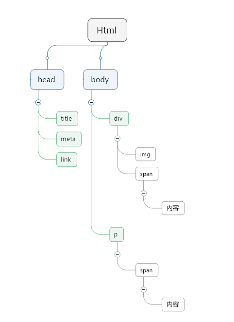
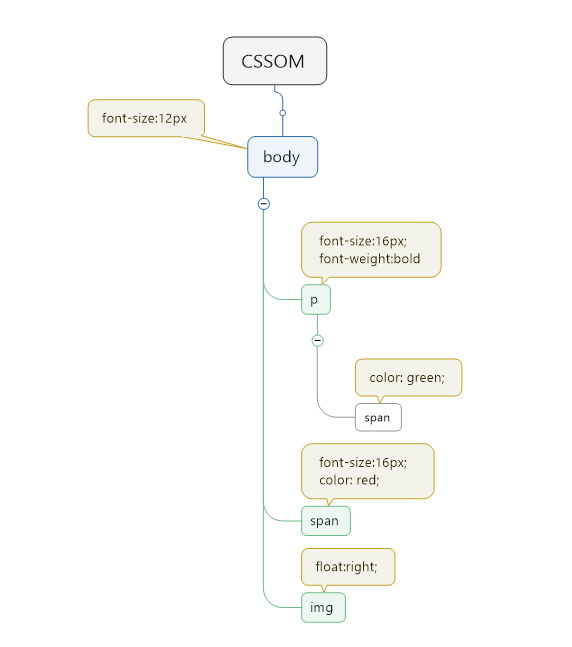
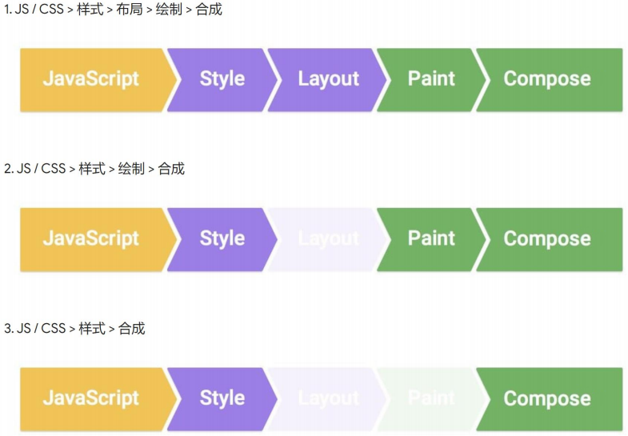
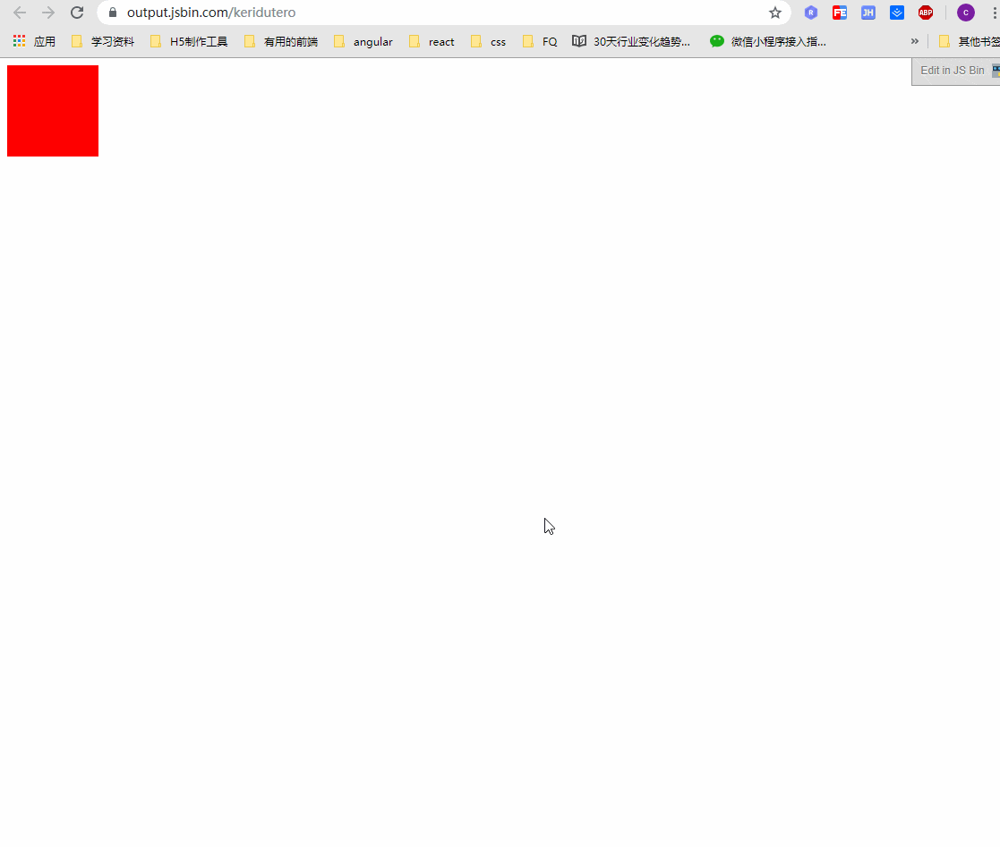
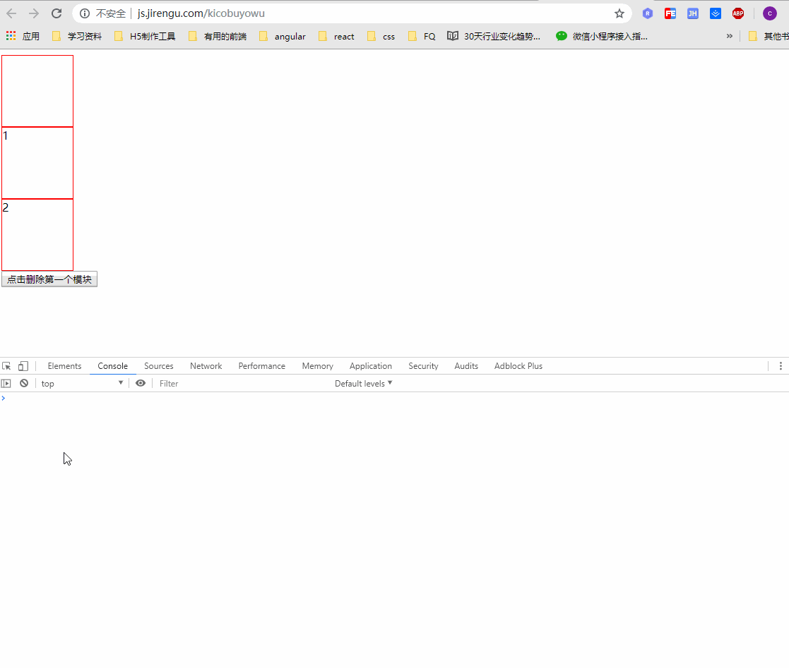
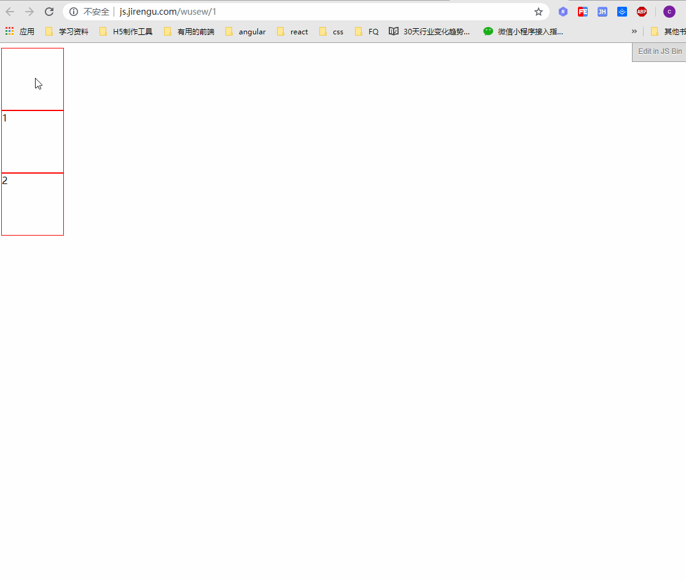

`CSS3` 相关的动画属性分别为： `transition`、`transform` 、`animation` 中文对应的分别为过渡、变换、动画。三者结合就构成光彩夺目的 `CSS3` 动画世界。当然我们本次的学习只是粗略的认识一下这三个东西，如果需要在 `CSS3` 动画上面有更高的层次，则考验的不仅仅是我们的 `CSS` 知识啦。

## CSS3 动画

### 先说说 Transition 

`transition` 的作用在于平缓的改变 `CSS` 的值。不论是点击事件，焦点事件，又或者是鼠标的 `hover` 操作，如果加上 `transition`  `CSS` 值发生改变后，效果就是平滑的，这就产生了动画。

#### transition 属性的构成

* `transition-property` 指定过渡时的属性值，例如：`transition-property:opacity` 意思就是指定 `opacity` 属性的过渡。
* `transition-duration` 指定过渡的持续时间。
* `transition-delay` 延迟的过渡时间。
* `transition-timing-function` 指定过渡动画的缓动类型，有如下属性值：
  * `ease` | `linear` | `ease-in` | `ease-out` | `ease-in-out` | `cubic-bezier()`
  * `linear` 线性过渡， `ease-in` 又慢到快， `ease-out` 由快到慢， `ease-in-out` 由慢到快再到慢

当然，我们再写 `transition` 过渡动画时，肯定不会摊开一个个写，而是结合在一块进行输出：

```css, html
<a href="javascript:;" class="trans">滑动经过</a>
.trans {
  display: inline-block;
  padding: 2px 10px;
  color: #f60;
  transition: all .5s;
}
.trans:hover {
  color: #fff;
  background: #486AAA
}
```

在线 [demo]

上面说到动画缓动类型，一个例子可以简单的理解，在线[demo](https://jsbin.com/tagupevaqe/4/edit?html,css,output)

了解更多请点击 [MDN](https://developer.mozilla.org/zh-CN/docs/Web/CSS/transition)

注意：`display:none` 到 `display:block` 是过渡不了的。

### 其次是 transform 

`transform` 指的是变换。它有 四个常用的功能，如下：

* 位移 `translate`
* 缩放 `scale`
* 旋转 `rotate`
* 倾斜 `skew`

```css
.trans_translate {transform: translate(100px)}
.trans_scale {transform: scale(1.5)}
.trans_rotate {transform: rotate(45deg)}
.trans_skew {transform: skew(35deg)}
```

`transform` 一般需要结合 `transition` 过渡效果，才会显示出威力。在线示例 [demo](https://jsbin.com/hocuquyuvi/1/edit?html,css,output)。

`transform` 变换涉及到的知识点就不一一阐述了，如果需要了解更多建议查询 [MDN](https://developer.mozilla.org/zh-CN/docs/Web/CSS/transform) 文档，跟着敲敲例子应该就能入门了，之后的学习就是一个积累的过程了。

### 再次是 animation

一个例子引入的 `animation`。示例 [demo](http://js.jirengu.com/yawelozede/2/edit)

可以从例子里得出，如果我们需要做连贯动画的话其实还得借助 `JS`。那么 `CSS` 能否做到呢？于是 `animation` 闪亮登场。

使用 `animation` 改写的上述例子 [demo](http://js.jirengu.com/yawelozede/6/edit)。

`animation` 的关键在于 `@keyframes xxx` 声明一个关键帧，查询详情请看 [MDN](https://developer.mozilla.org/zh-CN/docs/Web/CSS/@keyframes)

#### animation 属性组成

`animation` 是一个简写的方式，是由：时长 | 过渡方式 | 延迟 | 次数 | 方向 | 填充模式 | 是否暂停 | 动画名称 组成的。具体参考 [MDN](https://developer.mozilla.org/zh-CN/docs/Web/CSS/animation)

`animation` 重要的点：

* ` animation-direction ` 指示动画是否方向播放，有如下属性值
  * `normal` 默认属性，动画循环结束后从头开始 [demo](https://jsbin.com/foweqilore/3/edit?html,css,output) 
  * `alternate` 动画交替反向运行，例如：`ease-in` 在反向运动时咋会是 `ease-out` [demo]( https://jsbin.com/foweqilore/5/edit?html,css,output ) 可以看出加了这个属性后效果明显变好。
  * `reverse` 反向运行动画，动画一个周期运行完之后，由尾到头运行是反着来的。[demo](https://jsbin.com/lihejicife/2/edit?html,css,output)
  * `alternate-reverse ` 反向交替，动画第一次运行是反向的，下次则是正向的，依次循环，如果设置了动画的运动次数则会看是奇数还是偶数。

* `animation-iteration-count` 定义动画在结束前运行的次数，默认1次，如果需要无限循环，属性值为 `infinite ` 即可。

## 浏览器渲染原理

浏览器的渲染步骤：

* 根据 `HTML` 构建 `HTML` 树（DOM）；
* 根据 `CSS` 构建 `CSS` 树（CSSOM）;
* 将两棵树合并为一颗渲染树（render tree）；
* `Layout` 布局（文档流、盒模型、计算大小和位置）；
* `Print` 绘制（把边框颜色、文字颜色、阴影等画出来）；
* `Compose` 合成（根据层叠关系展示画面）；

画图渲染步骤：

* DOM 树的构成

  

* CSSOM 树的构成

  

* 合成 `render tree` 

  

### 样式更新方式

如下代码：

```js
demo.style.background = 'red';
demo.style.display = 'none';
demo.classList.add('red');
demo.remove();
```

上述代码在浏览器是如何渲染？它们有什么不同？如下图



第一种方式，通过 `JS` 修改 `CSS` 后会从布局开始走，一直走到合成；

第二种方式，通过 `JS` 修改 `CSS` 后不走 `layout`；

第三种方式，通过 `JS` 修改 `CSS` 后不走 `layout` 与 `print` 直接走合成；

那么再回到上述的代码，上述代码走的是什么方式呢？

* `deme.style.background = 'red'` ；

  

  如上图所示，我们采用 `chrome`浏览器自带的功能。如果样式造成重绘则会变绿。如图所示，元素只有当背景色被修改时，变为了绿色。走了第二种渲染的方式。不用重新布局直接绘制即可。步骤是 `paint->compose`

* `demo.remove()`

  

  布局变动之后，会走第一种方式渲染，也就是 `layout->paint->compose`

* `改变transform后` 方式是什么？

  

  `transform` 会走第三种渲染方式，从图上可以看出只有开始和结束时才变绿，中间的是没有任何的绿色的。

查看更多的 `CSS` 属性触发什么渲染方式  [csstriggers](https://csstriggers.com/) 

## CSS 动画优化

* 使用 `requestAnimationFrame` 代替 `setTimeout` 或 `setInterval`（JS方面）。
* 使用 `transform` 的位移代替  `left/right/top/bottom` 等（CSS方面）；