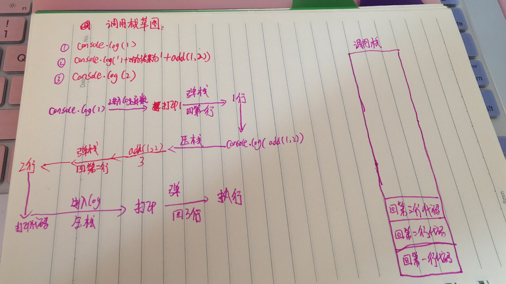

函数是一段可以反复调用的代码块。函数能接收输入的参数，不同的参数会返回不同的值。函数跟数组一样也是一种特殊的对象。

## 定义函数

* 具名函数定义

  ```js
  function fn(s) {
      console.log(s)
  }
  ```

* 函数表达式定义

  ```js
  let fn = function(x, y) {return x + y}
  let fn2 = function fn(x, y) {return x + y};
  fn2(); // fn is not defined, 等于号右边有名字的函数作用域只作用于等于号右边
  ```

* 箭头函数定义

  ```js
  let f1 = x => x*x
  let f2 = (x, y) => x + y // 如果是两个参数及以上则圆括号不能省略
  let f3 = (x, y) => {return x + y} // 如果有两个以上的语句则花括号不能省略， 且 return 也不能省略
  let f4 = (x, y) => ({name: x, age: y}); // 直接返回对象会报错，需要加一个圆括号
  
  f1(8); // 64
  f2(6, 7); // 13
  f3(5, 8); // 13
  ```

* 构造函数定义（不推荐，了解即可）

  ```js
  let fn = new Function('x', 'y', 'return x + y');
  // 等同于
  function fn(x, y) {
      return x + y
  }
  ```

**重点：所有函数都是 `Function` 构造出来的，包括 `Object` 、`Array` 、`Function` 也是**

### 函数本身与函数调用

```js
let fn = () => console.log('hi')
fn // 不会有任何结果，因为函数本身没有调用
fn(); // 'hi' 加入括号之后就是函数调用
```

```js
let fn = () => console.log('hi')
let fn2 = fn 
fn2(); 
/*
  1. fn 保存了匿名函数的地址
  2. 这个地址被复制给了f2
  3. fn2() 调用了匿名函数
  4. fn 和 fn2 都是匿名函数的引用（存了匿名函数的地址）
  5. 真正的函数不是 fn 也不是 fn2
*/
```

## 函数的要素

每个函数都有以下要素：

### 调用时机

如果一个函数在不同的时机调用，则也会返回不同的结果。那么如何确定调用时机呢？看几个例子。

例子1：

```js
let a = 1
function fn() {
  console.log(a)
}
// 打印什么？答：什么也不打印，因为函数没有调用，我们再看函数时一定要看函数有没有调用
```

例子2：

```js
let a = 1
function fn() {
  console.log(a)
}
fn()
// 打印什么？ 1， 因为 a 是全局变量
```

例子3：

```js
let a = 1
function fn() {
  console.log(a)
}
a = 2;
fn(); // 打印2， 因为在函数调用之前全局变量a被赋值为2
```

例子4：

```js
let a = 1;
function fn() {
  console.log(a)
}
fn()
a = 2; // 打印1 ，因为函数在变量更改之前已经调用
```

例子5：

```js
let a = 1
function fn() {
  setTimeout(() => {
    console.log(a)
  }, 0)
}
fn();
a = 2; // 打印2，因为在一段时间后才打印a，此时a已经更改为了2
```

例子6：

```js
let i = 0;
for(i = 0; i < 6; i++) {
   setTimeout(() => {
     console.log(i)
   }, 0);
}
// 打印出6次6，因为setTimeout 会在for执行完成之后再执行
```

例子7：

```js
for(let i = 0; i < 6; i++) {
   setTimeout(() => {
     console.log(i)
   }, 0);
}
// 依次打印 0， 1， 2, 3， 4， 5 ，这是 js 内部对for循环的处理，前提是用了 let，每次循环会多创建一个 i
```

可以看出来，在调用之前变量会发生改变，那么调用时值也会跟着改变，就是不同的时机会得到不同值。所以在调用函数之前一定要想明白应该何时调用，才能得到想要的值。

### 作用域

作用域就是指变量存在的范围，在 `ES5` 中 `JS` 只有两种作用域：全局作用域和函数作用域。`ES6` 中新增块级作用域。下面的例子，带着我们走进作用域的世界：

例子1：

```js
function fn() {
  let a = 1
}
console.log(a); // a is not defined, 第一函数没执行，如果函数执行 a 也是局部变量
```

例子2：

```js
function fn() {
  let a = 1
}
fn()
console.log(a); // a is not defined  因为 a 是fn的局部变量
```

#### 全局变量与局部变量

在顶级作用域声明的变量就是全局变量，如：`window` 的属性就是全局变量，其他都是局部变量。

```js
window.a = 1;
function fn() {
  console.log(a);
}
fn(); // 打印1

function fn1() {
  window.c = 2
}
fn1();
function fn2() {
  console.log(c)
}
fn2(); //  2
```

作用域可以嵌套，如下代码：

```js
function f1() {
  let a = 1
  function f2() {
    let a = 2
    console.log(a)
  }
  console.log(a)
  a = 3
  f2() // 打印2
}
f1() // 打印1 
```

`JS` 函数都是静态作用域，就是说跟函数的执行没有任何关系，作用域都是在定义时就已经确定 。

作用域规则：

* 如果多个作用域有同名变量，在查找变量的声明时，采用「就近原则」向上取最近的作用域
* 查找变量的过程与函数执行无关
* 但是变量的值与函数执行有关，先确定变量然后再确定变量的值

根据以上规则可以得出以下例子的答案：

```js
function f1() {
  let a = 1
  function f2() {
    let a = 2
    function f3() {
      console.log(a) // 根据就近原则这里的a是f2作用域里的，当外层的被赋值为22时，这里自然也是22拉
    }
    a = 22
    f3()
  }
  console.log(a)
  a = 100
  f2()
}
f1() // f1函数作用域里的a 值为1
```

### 闭包

如果一个函数用到了外部的变量，那么这个函数加这个变量就叫做**闭包**

```js
function f1() {
  let n = 999;
  function f2() {
    console.log(n);
  }
  return f2;
}
var result = f1();
result(); // 999
```

上述代码中，`n` 与 `f2` 函数就组成了闭包，目的是为了在外部获取 `f1` 的局部变量。

### 参数

函数参数可以分为，形式参数与实际参数两种。

```js
function add(x, y) {
  return x + y
}
// x, y 是形式参数，因为函数还没有执行不确定它们是什么
add(1, 2) // 1, 2 是实际参数
```

#### 参数的一些注意事项

* 函数参数如果是原始类型的值（数值、字符串、布尔值），参数在这里拷贝的是他们原始值，所以在函数内修改参数并不会影响到函数外部的。

```js
let a = 1;
let b = 2;
function fn(a, b) {
   a = 3;
   b = 4
}
a // 1
b // 2
```

* 函数的参数如果是复合类型的值（数组、对象函数），参数拷贝的是一个地址，如果函数内部修改参数，则会影响函数外部的原始值。

```js
let obj = {value: 1}
function f(o) {
  obj.name = 'Jacky'
}
f(obj)
obj // {value: 1, name: 'Jacky'}
```

* 如果函数内部修改的，不是参数对象的某个属性，而是替换掉整个参数，这时不会影响到原始值。

```js
let arr = [1, 2, 3];
function f(a) {
  a = [2, 3, 4];
}
f(arr);
arr // [1, 2, 3]
```

* 形参可多可少。

```js
function add(x) {
  return x + arguments[1]
}
add(1, 2)

function add2(x, y, z) {
  return x + y
}
add2(1,2)
```

### 返回值

* 每个函数都有返回值，如果没有写返回值，则会返回 `undefined`

  ```js
  function fn() {
    console.log('hi')
  }
  fn(); // 返回值为 undefined,
  ```

  注意：函数只有在执行后才会有返回值。

### 调用栈（重点）

什么是调用栈？`JS` 引擎在调用函数前会做一些操作 。具体如下：

* 需要把函数所在的环境 `push` 到一个数组里；
* 这个数组就叫做调用栈；
* 等函数执行完毕，就会把环境弹出来；
* 然后 `return` 到之前的环境中，继续执行后续代码；

```js
console.log(1);
console.log('1+2的结果为' + add(1, 2));
console.log(2);
```

上述代码的调用栈是怎么样的呢？如下草图：



从上面的草图可以看到，每一次的函数执行都是严格按照上述的步骤进行的操作，但是会不会有这么一种情况，一直在压栈，栈会不会溢出，也就是说会不会满了呢？这就需要引进递归的概念。

#### 递归

```js
function fn(n) {
  return n !== 1 ? n * fn(n-1) : 1
}
// 这是一个阶乘函数
```

```js
// 解析执行函数
fn(4)
= 4 * fn(3)
= 4 * (3 * fn(2))
= 4 * (3 * (2 * fn(1)))
= 4 * (3 * (2 * (1)))
= 4 * (3 * (2))
= 4 * (6)
24

// 递归，就是先递进再回归
```

递归函数的调用栈很长，可能会出现栈溢出的情况，也就是**爆栈**。每个浏览器的调用栈的最大值都不一样，可以通过以下代码求出不同浏览器的最大值:

 ```js
function computeMaxCallStackSize() {
  try {
    return 1 + computeMaxCallStackSize();
  } catch (e) {
    return 1;
  }
}
 ```

### 函数提升

```js
fn(); // 打印1
function fn() {
  console.log(1)
}
```

不管**具名函数**声明在哪里，它都会跑到第一行。

```js
fn(); // 报错 Cannot access 'fn' before initialization
let fn = function () {console.log(1)}
// 这里的fn是赋值，是函数表达式
```

### arguments 与 this

每个函数都有 `arguments` 与 `this` ,除箭头函数外。

```js
function fn() {
  console.log(arguments); // [1, 2] 伪数组
}
fn(1, 2);
```

`argument` 关键字是一个参数组成的伪数组，并没有数组的共有属性。可以通过 `Array.from` 转换为真正的数组。

只有函数调用时，`arguments` 才能起作用。

```js
function fn() {
  console.log(this); // js在未指定this时默认是window
}
fn();
```

可以用 `.call` 方法显示的指定函数的 `this`。

```js
function fn2() {
  console.log(this) // 对象 {name: 'Jacky'}
}
fn2.call({name: 'Jacky'})
```

```js
let person = {
  name: 'Tom',
  sayHi: function() {
    console.log(this.name); // 'Jacky'
  }
}
person.sayHi.call({name: 'Jacky'})
```

`.call` 方法的第一个参数是需要指向的 `this` 对象，剩余参数则是函数的实参。

```js
function add(x, y) {
  return x + y
}
add.call(undefined, 1, 2); // 3
```

如上代码，在使用 `call` 方法时，第一个参数作为 `this` , 但是代码中并没有用到 `this` 只能用 `undefined` 或者 `null` 占位。

```js
Array.prototype.forEach2 = function(fn) {
  for (let i = 0; i < this.length; i++) {
    fn(this[i], i);
  }
};
let arr = [1, 2, 3]
arr.forEach2.call(arr, (item, index) => {
  console.log(item); // 1  2 3
  console.log(index); // 0 1 2
});
```

上述代码实现了简易版 `JS` 原生方法 `forEach` 的写法。可以通过 `call` 方法指定不同的 `this`。

#### this 的两种使用方法

* 隐式传递

  ```js
  fn(1, 2); // 等价于 fn.call(undefined, 1, 2)
  obj.child.fn(1); // 等价于 obj.child.fn.call(obj.child, 1);
  ```

* 显示传递

  ```js
  fn.call(undefined, 1, 2);
  fn.apply(undefined, [1, 2]);
  ```

  `apply` 方法与 `call` 一样都是可以修改 `this` 指向，只有后续的传参不一样，`apply`  方法时把后续的参数都放如一个数组中，而 `call`方法的参数则是一个个传。

#### this 绑定

```js
function fn1(p1, p2) {
  console.log(this); // {name: 'Jacky'}
  console.log(p1); // undefined 因为p1没传参
  console.log(p2); // undefined 因为p2没传参
}
let fn2 = fn1.bind({name: 'Jacky'})
fn2();
// fn2 是 fn1 绑定之后的新函数
// fn2() 等价于 fn1.call({name: 'Jacky'})
```

`bind` 方法可以绑定其他参数

```js
function fn1(p1, p2) {
  console.log(this); // {name: 'Jacky'}
  console.log(p1); // 'hi'
  console.log(p2); // 'hello'
}
let fn3 = fn1.bind({name: 'Jacky'}, 'hi', 'hello')
fn3();
// fn3() 等价于 fn1.call({name: 'Jacky'}, 'hi', 'hello')
```

## 箭头函数

箭头函数没有 `arguments` 与 `this`。

```js
let fn = () => console.log(arguments);
fn(1, 2, 3); // arguments is not defined
```

箭头函数的 `this` 是由外部的 `this` 确定的。

```js
console.log(this) // window
let fn = () => console.log(this)
fn(); // window
```

箭头函数的 `this` 一旦确立下来，便不会再次改变除非是外部的 `this` 改变了。

```js
console.log(this) // window
let fn = () => console.log(this)
fn.call({name: 'jacky'}); // window
```

## 立即执行函数

在 `ES5` 时，如果为了得到一个局部变量需要在一个函数作用域里声明，如下：

```js
function fn() {
  var a = 1;
  console.log(a)
}
fn(); // 1
```

虽然这样可以声明了一个局部变量，但是紧接着又造成了另外的问题，就是多出一个全局的函数执行来。`fn` 为全局函数。

那如果是匿名函数，然后立即执行呢？这样不会是全局函数了。如下代码：

```js
function () {
  var a = 1;
  console.log(a)
}() 
```

那不好意思上述的代码语法 `JS` 是报错的，但是在某些语法格式下是不报错并且是执行的。

```js
+ function () {
  var a = 1;
  console.log(a)
}() // 1

- function () {
  var a = 1;
  console.log(a)
}() // 1

1* function () {
  var a = 1;
  console.log(a)
}() // 1

! function () {
  var a = 1;
  console.log(a)
}() // 1
```

匿名函数立即执行，这就是立即执行函数，可以把 `JS` 的作用域缩小在此匿名函数中，而不会造成全局的污染，推荐使用 `!` 来执行。

## 总结

每个函数都有以下的几个特点：

*  调用时机
* 作用域
* 闭包
* 形式参数
* 调用栈
* 返回值
* 函数提升
* arguments（除箭头函数外）
* this （除箭头函数外）

## 经典面试题

```js
let i = 0;
for(i = 0; i < 6; i++) {
  setTimeout(() => {
    console.log(i)
  }, 0)
}
```

上述代码输出什么？答案：6个6。`setTimeout` 方法的意思是一段时间后执行后续的操作，那一段时间是什么呢？就是等所有的代码执行完毕之后，我再执行。是一个异步的操作。当前执行的代码就是 `for` 循环，当执行完毕之后 `i` 的值已经变为 `6` 所以再进行 `setTimeout` 就是打印6个6。

```js
for(let i = 0; i < 6; i++) {
  setTimeout(() => {
    console.log(i)
  }, 0)
}
```

上述代码输出什么？答案：`0,1,2,3,4,5` 依次打出。具体原因参考[let与const](https://jinchao1992.github.io/2019/09/js-变量声明之let与const/)这篇文章。

那么如果我不想用第二种写法来实现打印出 `0,1,2,3,4,5` 怎么做呢？如下代码：

```js
let i = 0;
for(i = 0; i < 6; i++) {
  !function(i) {
     setTimeout(() => {
      console.log(i)
     }, 0)
  }(i)
}
```

##  延伸阅读

[【JS 口袋书】第 3 章：JavaScript 函数](https://juejin.im/post/5d9d21a7f265da5ba74524a4)

