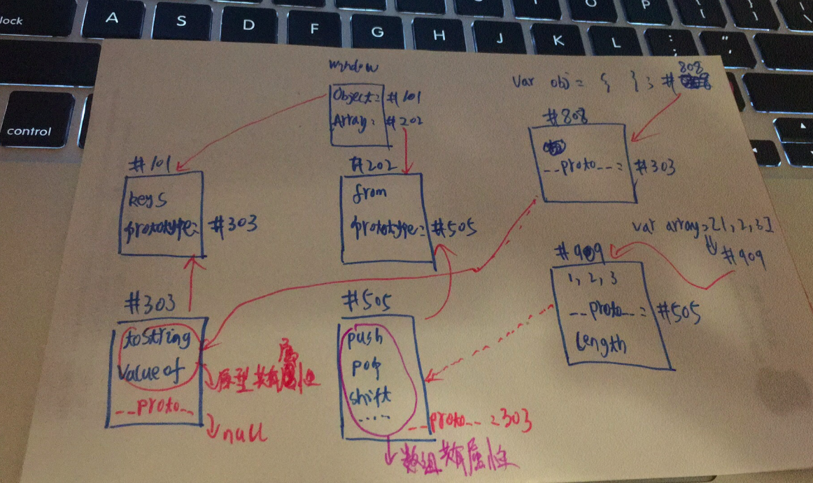

## 操作系统是什么？

操作系统（Operating System）简称为 `OS`；

### 电脑开机发生了什么？

* 操作系统在 `C` 盘里，或者其他盘；
* 当按下开机键时，主板通电，开始读取固件；
* 固件就是固定在主板里面的存储设备，里面放着开机程序；
* 开机程序将文件里的 **操作系统** 加载到内存中运行；

### 操作系统被加在内存后发生了什么？

* 首先加载操作系统内核；
* 然后启动初始化进程，编号为1，每个进程都一个编号；
* 启动系统服务：文件、安全、联网等；
* 等待用户登录：输入密码登录或 `ssh` 登录；
* 登录之后运行 `shell` 用户就可以跟操作系统对话了；

## 打开浏览器之后发生了什么？

* 打开浏览器后，就会运行浏览器文件；
* 开启浏览器进程，作为主进程；
* 主进程会开启一些辅助进程，如网络服务、`GPU` 加速；
* 每新建一个网页，就有可能会开启一个子进程；

 ### 浏览器功能

* 发起请求，下载 `HTML` 解析 `HTML` 下载 `CSS ` 解析 `CSS` 渲染界面；
* `渲染` 就是浏览器把 `HTML` 与 `CSS` 合起来放入到网页中就是渲染；
* 渲染界面后，下载 `JS` 解析 `JS` 执行 `JS`等；

#### 功能模块

* 用户模块，渲染引擎，`JS` 引擎，存储等；
* 这些模块存储于不同的 **线程** 中；
* 如果把进程比作是一个工厂的话，那么线程就是工厂内的流水线；

> `JS` 是单线程运行的；因为一个页面只能开一个渲染线程和`JS` 渲染线程；
>
> 既然是单线程的，那么，`JS`是如何进行渲染线程呢？答案：可以通过 `跨线程通信` 进行渲染；所以导致了一个现象就是 **`JS` 操作 `DOM` 慢**，因为是跨线程运行，在修改 `DOM` 时需要先去进行 `渲染线程`操作。

## JS 引擎

`chrome` 与 `Node JS`  使用的 `v8` 引擎，使用 `C++` 编写；

### 主要功能

* 编译：把 `JS` 代码翻译为机器能执行的字节码或者机器码；
* 优化：改写代码，使其更加高效；
* 执行：执行上述的字节码或者机器码；
* 垃圾回收：把 `JS`用完的内存回收，方便之后再次使用；

### 执行 `JS` 代码

* 提供 `API` ，如：`window`、`document`、`setTimeout` 这些都有浏览器提供；

* `JS` 代码存放在内存中，如下图所示：

   

#### 栈堆区

栈和堆都是存储数据的，只不过它们的存放数据方式不一样；

* `Stack` 栈区，每个数据顺序存放；一个一个存放不准跳过；
* `Heap` 堆区，每个数据随机存放；随机存放区域，只要在堆区想在哪里就在哪里；如果开辟的内存不够存储，则会重新开辟内存，之前的会被删除；   

堆栈举例说明：

```js
var a = 1;
var b = a;
var person = {
   name: 'Jacky',
   child: {
       name: 'Tom'
   }
};
var person2 = person;
```

上述的代码转换为内存图显示为：


## JS 初始化的东西

* `window`
* `console` 挂载在 `window`上
* `documen` 挂载在 `window`上
* `Object` 挂载在 `window`上
  * 声明对象可以用 `var person = {}` 或 `var person = new Object()`

* `Array` 挂载在 `window`上，Array 是一种特殊的对象；
  * 声明数组可以用 `var array = []` 或 `var array = new Array()`
* `Function` 挂载在 `window` 上，`Function` 是一种特殊的对象；
  * 声明方式：`function fn() {}`等价于 `fn = new Function()`

### window里的是如何在内存中存储的？

挂载在 `window` 里是为了方便使用，因为在任何地方都可以使用。

`window` 内存分配草图：


注意：`window.console` 指向或引用了这个对象，就是保存了一个地址；

`console.dir(对象)` 可以打出对象的结构；如：`console.dir(window.Object)`


上图就是打印的 `Object` 对象的构成；

注意：变量与对象是不同东西，变量里可以存放对象的地址；

### 原型链（prototype）

 先看一段代码 `console.dir(Object.prototype)` 的打印结果：


再来看另外一段代码：

```javascript
var obj = {};
obj.toString(); // 这里为什么可以调用，并没有在obj对象中写toString？？
```

以下原因可以说明：

* `obj` 有一个隐藏属性，叫 `__proto__`;
* 隐藏属性存储了 `Object.prototype` 对象的地址；
* `obj.toString()`发现 `obj` 上没有 `toString` 就去隐藏属性里面找对应的 `toString`，然后就找到了`Object.prototype.toString`

第三段代码：

```javascript
var obj2 = {};
obj2.toString();
// obj 与 obj2 有什么联系？
```

相同点，它们都可以调用 `.toString()` 方法已经更多的方法；

不同点，它们指向的地址不同 `obj !== obj2` 有图作证：


**结论：`Object.prototype`存储了`obj` 对象的共有属性，这就是原型，原型存在的意义就是无需声明重复的共有属性，省了代码又省了内存。** 

**注意：每个对象都有一个隐藏的属性，指向了原型，如果没有隐藏属性的话，那么我们声明对象时就找不到共有属性，就需要规定一个对象写一堆属性，所以此隐藏属性非常重要，这个隐藏属性就叫做 `__proto__`。**

#### `prototype 与 __proto__` 区别是什么？

* 两者都存着原型的地址，`prototype` 挂载在函数上，`__proto__` 挂载在每个新生产的对象上；

那么 `JS` 世界中，原型到底是个什么的存在呢？一图可以解决：



## 结语

`JS` 的大门开启了，学习 `JS` 内存世界后对之前的 `原型` 与 `原型链` 知识有了更加深刻的理解了，这只是一小步，`JS` 世界里还有更多更好玩的东西等待着。所以需要更加努力的学习了！！加油！！！