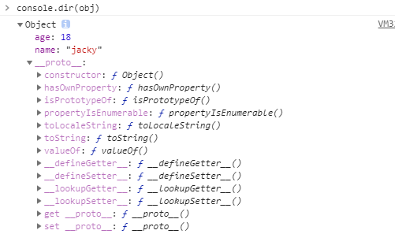

## 前言

`Javascript` 有七种数据类型，分别是： `number`、`string`、`boolean`、`symbol`、`undefined`、`null`、`object`。其中除 `object` 外都为简单类型，`object` 为复杂类型。对象(object)是 `JavaScript` 中的难点，也是学好 `JavaScript` 必须具备的知识，所以学好对象非常重要，那么一起来看吧。

## 对象

### 定义

* 无序的数据集合；
* 键值对(key-value)的集合；

```js
let obj = {name: 'jinchao', age: 20}
let obj2 = new Object({name: 'jinchao', age: 20})
```

以上两种写法都能定义对象，只不过大部分时候定义对象是用的第一种写法，因为第一种写法更简单。

### 键名

对象的所有键名(属性名)都是字符串，所以加不加引号都可以。如果没加引号，`JS` 会自动解析为字符串。

```js
let obj = {
  1: 'a',
  2: 'b',
  3.2: 'c',
  1e2: 100,
  1e-2: 0.01
};
```

上面代码中，对象 `obj` 的所有键名看上去是数值，实际上都被自动转成了字符串。

如果键名不符合标识符的规则（比如第一个是数字，或者含有空格或者运算符），则必须加上引号，否则会报错。所以省略引号后就必须按照标识符的命名方法写。

```js
let obj = {
  a_a: 'a',
  b_b: 'b',
  姓名: 'jinchao',
  $: 'c'
};

let obj2 = {
  5p: 'a' // 报错，此处的引号不能省略
};
```

注意：`Object.keys(obj)` 可以打印出对象的键值集合。

```js
let obj = {
  1: 'a',
  2: 'b',
  3.2: 'c',
  1e2: 100,
  1e-2: 0.01
};
Object.keys(obj); // ["1", "2", "100", "3.2", "0.01"]
```

#### 变量做属性名

```js
let a = 'xxx';
let obj = {
  a: '111',
  [a]: '222'
};
console.log(obj); // {'a': '111', 'xxx': 222}
```

如果想要一个变量做为对象的属性名，则必须用 `[]` 把属性括起来，这是 `ES6` 的新语法。 

使用 `[]` 几个注意的点：

* 如果不加 `[]` 的属性名会自动变为字符串；
* 加了 `[]` 则会被当作变量的求值；
* 求的值如果不是字符串，则会自动变为字符串；

### 对象的隐藏属性 

先看一个内存图：


通过上述内存图（画的有点糙，请忽略），得出结论：

* `JS` 中每一个对象都有一个隐藏属性 `__proto__`；
* 这个隐藏属性存储着其 **共有属性组成的对象** 的 **地址**， 注意是地址，也就是上图中标识 `#409`的东西；
* 这个**共有属性组成的对象** 就叫做原型；

```js
let obj = {};
obj.toString(); // "[object, Object]", 为什么可以调用？为什么不报错
// 就是因为obj的隐藏属性对应的对象上有toString()方法
```

### 原型

**每个对象都有原型；（注意是每一个只要是对象都有原型）**

* 原型里存着对象的共有属性；（就是：`obj.__proto__`对应的对象）;
* `obj.__proto__` 存着这个对象的地址；
* 这个对象中有所有对象的共有属性 `toString`、`valueOf` 等；

**对象的原型也是对象**

* 所有对象的原型也有原型；

* 所有对象的原型就是对象的根；

* 根对象的原型是 `null`;

  ```js
  let obj = {};
  console.log(obj.__proto.__proto__); // null
  ```

### 对象属性的增删改查

#### 删除属性

语法：`delete obj.xxx` 或者 `delete obj['xxx']`。其中 `obj` 是对象， `xxx` 是属性名称。

```js
let obj = {name: 'jacky', age: 18};
delete obj.name;
console.log(obj); // {age: 18}
```

另外一种写法：`obj.name = undefined` ；这其实是把属性值置为 `undefined` 并不是删除了属性；

```js
let obj = {name: 'jacky', age: 18};
obj.name = undefined;
console.log(obj); // {name: undefined, age: 18}
```

检测一个属性是不是存在对象中可以使用：`'name' in obj` 如果返回 `false` 表示对象中不存在这个属性，如果返回 `true` 则表示对象中是存在这个属性的；

**注意： `obj.xxx === undefined` 不能断定属性是不是存在 `obj` 中。**

验证示例：

```js
let obj = {};
let obj2 = {name: undefined};
console.log(obj.name === undefined); // true
console.log(obj2.name === undefined); // true
// 并不能通过上述的相等关系来判断一个属性在不在对象中;
// 而必须使用 'name' in obj 来进行判断
```


#### 查看属性

* 查看自身属性：`Object.keys(obj)`；

  ```js
  let obj = {name: 'jacky', age: 18};
  Object.keys(obj); // ['name', 'age'];
  ```

* 查看自身属性对应的值的集合： `Object.values(obj)`；

  ```js
  let obj = {name: 'jacky', age: 18};
  Object.values(obj); // ['jacky', 18];
  ```

* 查看自身属性与对应值的集合：`Object.entries(obj)`；

  ```js
  let obj = {name: 'jacky', age: 18};
  Object.entries(obj); // [['name', 'jacky'], ['age', 18]];
  ```

* 查看共有属性与自身属性：`console.dir(obj)`；

  

那么如何判断一个属性是对象自身的还是共有的属性呢？答案是 ：肯定有

`obj.hasOwnProperty('toString')` 其中 `obj` 为对象名， `toString` 为属性名，如果属性名是自身属性则返回 `true` 否则返回 `false`。

```js
let obj = {name: 'jacky', age: 18};
obj.hasOwnProperty('name'); // true
obj.hasOwnProperty('toString'); // false
```

##### 查看单个属性

* 中括号语法：`obj['key']` 或者 `obj[key]` 其中的 `key` 是变量；
* 点语法：`obj.key`; 点后面跟着的永远是字符串；

```js
let aaa = "haha";
let obj = {name: 'tom', age: 18, haha: '哈哈哈'};
obj[aaa] === obj['haha'] // true
obj['na'+'me'] // "tom"
```

### 修改或增加属性（写属性）

#### 直接赋值

```js
let obj = {name: 'jinchao'};
obj.name = 'Tom'; // 直接修改obj的name属性
obj['name'] = 'jacky'; // 当然也可以使用中括号的方式
obj[name] = 'cc'; // 这样写并不会修改obj的name属性值，因为 name是个变量它的值不确定
```


如上图所示，如果我们直接给 `obj[name]` 赋值则会在 `obj` 对象增加一个属性名为 `''` 的属性，因为 `name` 是属于 `window` 里的默认属性，值为空字符串；

#### 批量赋值

 ```js
let obj = {name: 'jinchao'};
Object.assign(obj, {age: 18, gender: '男'});
console.log(obj); // {name: 'jinchao', age: 18, gender: '男'}
 ```

注意：批量赋值，可以跟无数个属性，而不需要单独一个一个属性添加；那如果已经存在的属性则会是后续加的属性赋值的会替换之前存在的属性值；

#### 增加或者修改共有属性

**无法通过自身修改或增加共有属性**，共有属性只是可读而不可改，如下代码：

```js
let obj = {name: 'Tom'};
let obj2 = {name: 'jacky'};
obj.toString = 'xxx';
obj2.toString // 输出的还是共有属性toString
```

如果必须修改原型上的属性，可以用以下两种方法：

```js
obj.__proto__.toString = 'xxx'; // 不推荐使用__proto__
Object.prototype.toString = 'xxx';
obj2.toString // "xxx"
```

**警告：一般不要修改原型！！！**

#### 修改对象的隐藏属性

```js
let obj = {name: '张三'};
let obj2 = {name: '李四'};
let common = {hairColor: 'black', country: '中国'};
obj.__proto__ = common; // 此刻把obj的隐藏属性修改为了common对象
obj2.__proto__ = common; // 此刻把obj2的隐藏属性修改为了common对象
```

上述代码把对象的隐藏属性都换成了 `common` 对象，既然 `common` 也是对象所以也是有隐藏属性 `__proto__`并且就是对象的共有属性，也就是原型；


通过上图可以看到，虽然我们把 `obj` 的隐藏属性修改了，但是它还是可以访问 `obj.toString` 那是因为我们修改的 `obj.__proto__` 也是一个对象也有原型，原型就是根对象，里面存放着共有的属性，所以会一级一级的往上查找，这就是形成了原型链；

**注意：修改对象隐藏属性不推荐直接使用`__proto__`**。推荐使用下面的写法：

 ```js
let common = {hairColor: 'black', country: '中国'};
let obj = Object.create(common);
obj.name = '张三';
let obj2 = Object.create(common);
obj2.name = '李四';
Object.assign(obj2, {age: 18, city: '北京'});
console.log(obj.country); // "中国"
console.log(obj2.country); // "中国"
 ```

`Object.create(common)` 修改的是原型属性；

### 对象类型数据转换

#### 对象的强制类型转换

在之前的文章中介绍过[数据类型转换]() ,只是介绍了基本类型之间的转换，并没有涉及对象，因为对象比较复杂，现在一起来看看对象是如何进行转换的吧！

##### 对象转换为数字

如果一个其他类型的数据想要转换为数字类型，强制转换话需要使用 `Number` 方法，那么对象也是可以使用的，但是解析机制不一样；

```js
Number({a: 1}); // NaN，调用toString 返回 "[object, Object]" 再调用 Number
Number([1,2,3]); // NaN， 调用toString 返回字符串"1,2,3" 再调用 Number
Number([5]); // 5 调用toString 返回字符串"5" 再调用 Number，则返回5
```

转换规则：

* 调用对象自身的 `valueOf` 方法。如果返回的是原始类型的值（也就是简单类型），则直接对该值使用 `Number` 函数，不再进行后续 的步骤。
* 如果 `ValueOf` 方法返回的还是对象，则改为调用对象自身的 `toString` 方法。如果 `toString` 方法返回原始类型的值，则对该值使用 `Number` 函数，不再进行后续步骤。
* 如果 `toString` 返回的是对象，则报错。

根据转换规则，上面的代码是先调用 `valueOf` 方法，默认情况下对象的 `valueOf` 返回对象本身，所以就走第二步调用 `toString` 方法，而 `toString` 返回对象的类型字符串，`[object, Object]` ，再调用 `Number` 则返回 `NaN`。

如果 `toString` 方法返回的不是原始类型的值，结果就会报错，如下代码:

```js
let obj = {
  valueOf: function () {
    return {};
  },
  toString: function () {
    return {};
  }
};
Number(obj); // Cannot convert object to primitive value
```

##### 对象转换为字符串

使用 `String` 方法转换对象，如果是对象则返回一个类型字符串，如果是数组对象则返回该数组的字符串形式。

```js
String({a: 1}); // "[object, Object]"
String([1,2,3]); // "1,2,3"
```

转换规则与转换数字基本一致，只是先调用 `toString`  然后再调用 `valueOf`。

* 先调用对象自身的`toString`方法。如果返回原始类型的值，则对该值使用`String`函数，不再进行之后的步骤。
* 如果`toString`方法返回的是对象，再调用原对象的`valueOf`方法。如果`valueOf`方法返回原始类型的值，则对该值使用`String`函数，不再进行之后的步骤。
* 如果`valueOf`方法返回的是对象，就报错。

##### 对象转换为布尔值

所有的对象转换为布尔值都为 `true` 包括空对象。

```js
Boolean({}); // true
Boolean([]); // true
Boolean({a: 1}); // true
Boolean([1,2]); // true
```

