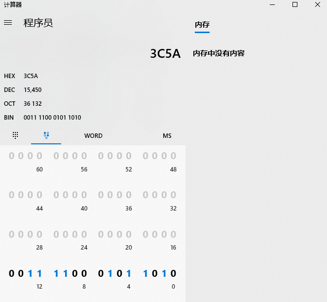
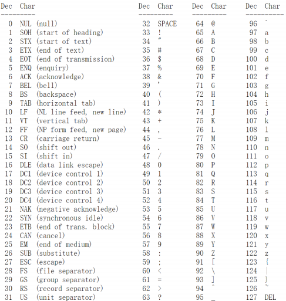
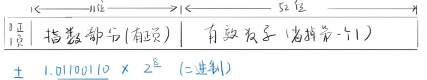
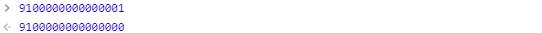

## 前言

数据为什么需要类型？1与'1'，两者都是一为什么要区分呢？

* 功能不同
  * 数字可以进行加减乘除，字符串不行；
  * 字符串能表示电话号码，数字不行；

* 存储形式不同
  * `JS` 中，数字是用64位浮点数的形式存储的；
  * `JS` 中，字符串是用类似 `UTF-8` 形式存储的；

## 如何存储数字

十进制转换二进制即可；

### 十进制如何转换成二进制

算数比较小的话，可以先找小于并且相邻这个数最近的2的N次方。然后依次。如：

```
37 = 32 + 4 + 1;
对应：100101 （32 16 8 4 2 1 有的写1，没有则写0）
```

### 二进制转换十进制

> 口诀：每一位乘以2的N次方，然后相加。（从2^0开始）

```
100011 = 1*2^5 + 0*2^4 + 0*2^3 + 0*2^2 + 1*2^1 + 1*2^0 = 35 
```

由于二进制写起来比较慢，所以用十六进制来代替二进制；

### 二进制转换为十六进制

举例说明：

```
011110001011010 转换为 16进制
1. 从右往左，每四位改写一位，四位分割后，如下格式：
  011 1100 0101 1010
2. 分别用8421对应四位数值
  011 1100 0101 1010
  421 8421 8421 8421 
   3   12   5    10
3. 大于9的数字改写为ABCDEF，最终得出3C5A
```

计算器程序员模式:



* HEX 表示16进制，BIN表示2进制，OCT 表示8进制，DEC 表示10进制；

## 如何存放字符

### 使用编号表示，编号表如下：



* 0 表示结束字符；
* 10 表示换行；
* 13 表示回车；
* 32 表示空格；
* 33 到 47表示标点；
* 48 到 57表示数字符号，分别对应数字0~9；
* 65 到 90 表示大写字母，分别对应大写字母A~Z;
* 97 到 122 表示小写字母，分别对应小写字母a~z;
* 127 表示删除键；

### 使用 GB2312 表示汉字编号

* 使用 `0000` ~ `FFFF` 表示汉字 ，一个16进制数是4个0/1位；

* `FFFF` 就是4*4=16位，也就是两个字节；
* 最多收录 `2^16 = 65536` 个字符；

[参考 GB2312 编码表](http://tools.jb51.net/table/gb2312) 

中国文化博大精深，存在很多生僻字以及繁体字，但是 `GB2312` 并没有存进去。于是微软推出了国标扩展 `GBK`;

### GBK 国标扩展

* 包含 `21886` 个汉字和图形符合；
* 收录了中日韩使用的几乎所有汉字；
* 完全兼容 `GB2312`;
* 依然使用 `16` 位（两个字节）；

### Unicode 万国码

* 优点
  * 收录了13万字符，全世界通用；
  * 还在继续扩充；

* 缺点
  * 两个字节不够用，每个字符要使用三个及以上字节；
  * 造成文件扩大；

### UTF-8 出现

UTF-8是一种编码规则。

## JS中的数据类型

* 数字 `number`
* 字符串 `string`
* 布尔 `bool`
* `undefined`
* `null`
* `symbol`
* `object`

### 数字类型

数字是由64位浮点数组成的。

####　特殊值

* `+0` `-0` `0`

* 无穷大 ` Infinity`、`+Infinity`、`-Infinity`, 一般在除数为0时显示；
* 无法表示的数字 `NaN`；
* `NaN` 不等于任何值包括它自己；

#### 数字存储形式

* `JS` 数字是由64位浮点数组成的，浮点的意思就是浮动的点，就是小数点会乱动；

* 由于浮点数不是精确的值，所以涉及小数的比较和运算也会造成不精确的问题；

  ```js
  0.1 + 0.2 === 0.3 // false
  0.3 / 0.1  // 2.9999999999999996
  (0.3 - 0.2) === (0.2 - 0.1) // false
  ```

##### `JS` 浮点数组成方式：

* 第1位：符号位， `0` 表示正数， `1` 表示负数；

* 第2位到第12位（共11位）：指数部分；什么是指数？如：10^2 其中 2 代表10的2次方 那么 2 就是指数；指数可以是正数也可以是负数；范围是 ： `-1023 ~ 1024`;

* 第13位到第64位（共52位）：小数部分（即有效数字，开头的1省略）

  

#### 数字的范围和精度

##### 范围

> 64位浮点数的指数部分的长度是11个二进制位，意味着指数部分是最大值是2047（2的11次方-1）。也就是说，64位浮点数的指数部分的值最大为2047，分出一半表示负数，则 JavaScript 能够表示的数值范围为2的-1023次到2的1024次，超出这个范围的数无法表示。

举例1：

```js
Math.pow(2, 1024); // Infinity
```

如果一个数大于2的1024次方，那么就会发生“正向溢出”，也就是说 `JS` 表示不了，就会返回 `Infinity`。

举例2：

```js
Math.pow(2, -1075); // 0
```

如果一个数小于等于2的-1075次方（指数部分最小值-1023，加上小数部分52位），那么就会发生为 “负向溢出”，`JS` 无法表示这么小的数，这时就会直接返回0。

`JS` 中可以使用 `Number.MAX_VALUE` 和 `Number.MIN_VALUE` 返回可以表示的具体最大的值与最小的值。

```js
Number.MAX_VALUE // 1.7976931348623157e+308
Number.MIN_VALUE // 5e-324
```

##### 精度

* 最多只能得到53个二进制位表示有效数字；
* 2^53对应的十进制是9后面15个零；
* 15位有效数字都能精确表示，16位有效数字如果小于 90 开头，也能精确表示；反之则不能精确表示；如下图：



### 字符串

字符串有如下写法：

* 单引号 'Hello' 注意是英文的单引号；
* 双引号 "Hello" 注意是英文的双引号；
* 反引号 `` `Hello` ``；

**注意：`JS` 中需要输出单引号和双引号时，必须遵循 `单引号套双引号或者双引号套单引号`，优先使用反引号。如果需要在单引号或者双引号中必须使用单引号则可以使用**转义符**的形式。**

**约定俗成：由于 `HTML` 语言的属性值使用双引号，所以我们在写 `JS` 时字符串用的是单引号。一定要做到的是坚持使用一种风格，而不是风格交叉使用。**

#### 转义符

* `\'` 表示 `'`；
* `\"` 表示 `"`;
* `\n` 表示换行；
* `\r` 表示回车；
* `\t` 表示tab；
* `\\` 表示 `\`；
* `\uFFFF` 表示对应的是 `Unicode` 字符；
* `\xFF` 表示前256个 `Unicode` 字符；

#### 字符串与数组

> 字符串可以视为字符数组。只是相似仅此而已。

```js
let s = 'hello';
s[0] // "h"
s[1] // "2"
s[4] // "o"
// 直接对字符串使用方括号运算符
'world'[1] // "o"
```

注意：如果方括号中的数字超过字符串的长度，或者方括号中根本不是数字，则返回 `undefined`。

```js
'abcd'[4] // undefined
'abcd'[-1] // undefined
'abc'['x'] // undefined
```

字符串无法改变单个字符。

```js
var s = 'hello';
delete s[0];
s // "hello"

s[1] = 'a';
s // "hello"

s[5] = 'a';
s // "hello"

// 字符串内部无法改变和删除。
```

注意：字符串 `length` 属性也是无法改变，如果做出改变的话，会什么也不操作，也不会报错！

```js
var s = 'hello';
s.length // 5

s.length = 3;
s.length // 5

s.length = 7;
s.length // 5
```

#### Base64 转码

> 所谓 `Base64` 就是一种编码方法，可以将任意值转成 0～9、A～Z、a-z、`+`和`/`这64个字符组成的可打印字符。使用它的主要目的，不是为了加密，而是为了不出现特殊字符，简化程序的处理。

`JS` 原生提供两个 `Base64` 编码方法：

1. `btoa()` 任意值转换为 `Base64` 编码；
2. `atob()` `Base64` 编码转换为原来的值；

```js
window.btoa('hello') // "aGVsbG8="
window.atob('aGVsbG8=') // "hello"
window.btoa('您好') // 报错
```

如果需要将非 `ASCII`码字符转为 `Base64` 编码，必须中间插入一个转码环节。

```js
function b64Encode(str) {
  return btoa(encodeURIComponent(str));
}

function b64Decode(str) {
  return decodeURIComponent(atob(str));
}

b64Encode('你好') // "JUU0JUJEJUEwJUU1JUE1JUJE"
b64Decode('JUU0JUJEJUEwJUU1JUE1JUJE') // "你好"
```

### 布尔

> 布尔值代表“真”和“假”两个状态。"真"用关键字 `true` 表示， “假”用关键字`false`表示。布尔值只有这两个值。

运算符可以返回布尔值：

* `!` 非
* 相等运算符 `===` 、`==`、`!=` 、`!==`
* 比较运算符 `>` 、`<` 、`>=`、`<=` 

if 搭配布尔：

```js
if (value) {...} else {...}
```

五个 `falsy` 值：（`falsy` 相当于 `false` 但又不是 `false` 的值）

`undefined null 0 NaN ''` 注意：是 '' 字符串而不是' '空格字符串；

所以，`value` 中除五个`falsy` 值外都是 `true`;

### null 与 undefined

`null` 与 `undefined` 都表示“没有” 、“空”的意思。如果将一个变量赋值为 `undefined` 或 `null` 语法效果几乎没有区别。

#### 细节

* 如果一个变量声明了，但没有赋值，那么默认值就是 `undefined`, 而不是 `null`。
* 如果一个函数，没有写 `return` 那么默认 `return undefined` ，而不是 `null`。
* 在习惯上，把非对象的空值写为 `undefined`，把对象的空值写为 `null`。

