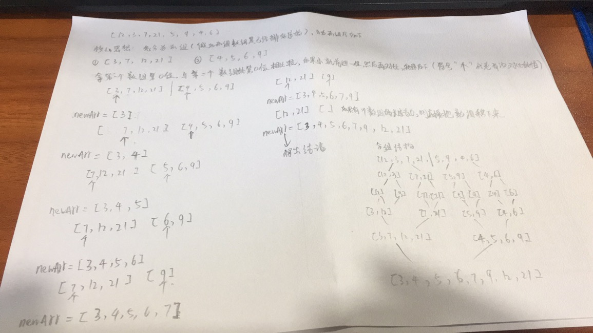
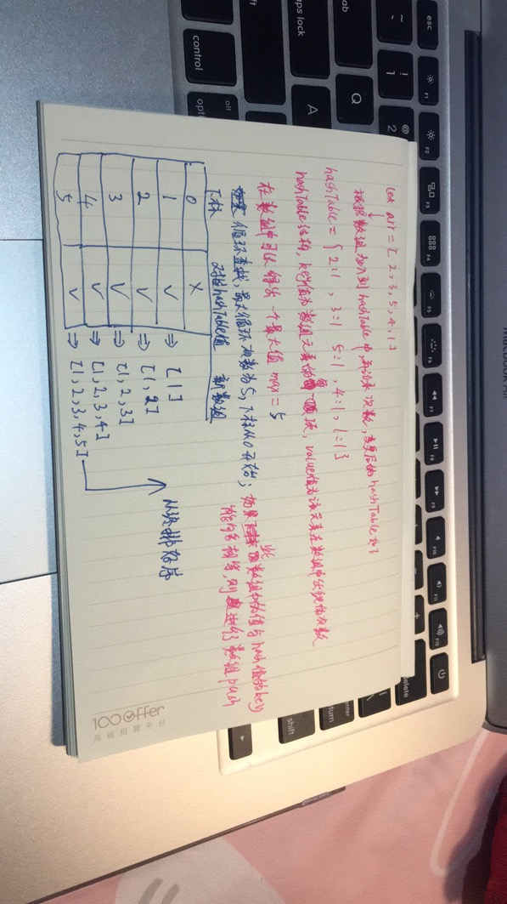

上一篇文章介绍了如何使用**递归**来进行排序。这节课我们使用循环来引入更多更好的排序。

## 选择排序

选择排序，就是每次找到一个最小的值，然后把它放到最前面（从小到大排列）。那如何找到最小值呢，思路：找到最小值的下标。如下代码：

```js
let minIndex = (numbers) => {
  let index = 0;
  for(let i = 1; i < numbers.length; i++) {
    // 循环着比对那个值大
    if (numbers[i] < numbers[index]) {
      index = i
    }
  }
  return index;
}
```

上述代码找到了一个数组中最小数值的下标。就可以找到当前数组中的最小的数字，那么就把这个数字放在最前面。然后再循环，再找最小的。假如，一个数组是这样的 `[3,5,4,2,1]` 可以看出第一次的最小值是 `1` 对应的下标则是 `4`。那么就需要把`1`放到最前面，就是要把 `1` 跟 `3` 的位置进行调换，调换之后把 `1` 站定 然后剩余的数字再进行比较，然后再调换。转换为代码如下：

```js
let sort = (numbers) => {
  // 为什么需要length-1，因为最后一次不需要比较，前几次占位之后，最后一次自然就确定位置
	for(let i = 0; i < numbers.length - 1; i++) {
    /*
	  为什么是numbers.slice(i) ？因为每次再循环找都是需要后面数字，已经排好序的则不需要再找
	  那为什么又需要 +i 呢？ 因为如果不加i的话，比如当前找到最小值的下标应该在原数组的第2位，
	  但是此时的slice后是一个新数组，下标会从零开始了，所以需要加上i
	*/
    let index = minIndex(numbers.slice(i)) + i;
    if(index !== i) {
      swap(numbers, index, i)
    }
  }
  return numbers
}

// 交换位置函数
let swap = (arr, i, j) => {
  let temp = arr[i]
  arr[i] = arr[j]
  arr[j] = temp
}
```

## 快速排序

快速排序的核心思想就是，找准一个基准值，一般都是中间值。然后比这个基准值大的放右边，比这个数小的放左边。然后再找，再排，以此类推。注意：当数组长度小于等于1时，就直接把这个数组返回出去。这是递归的终止条件。

```js
let quickSort = (numbers) => {
  if (numbers.length <= 1) {
    return numbers;
  }
  let index = Math.floor(numbers.length / 2)
  let indexVal = numbers.splice(index, 1)[0]
  
  let leftArr = []
  let rightArr = []
  
  for(let i = 0; i < numbers.length; i++) {
    if (numbers[i] < indexVal) {
      leftArr.push(numbers[i])
    } else {
      rightArr.push(numbers[i])
    }
  }
  return quickSort(leftArr).concat([indexVal], quickSort(rightArr))
}

console.log(quickSort(arr))
```

 ## 归并排序

归并排序算法，核心思想看如下图：



代码如下：

```js
let arr = [2, 3, 4, 5, 1]
let mergeSort = (arr) => {
  if(arr.length === 1 ) {
    return arr
  }
  let leftArr = arr.slice(0, Math.floor(arr.length / 2))
  let rightArr = arr.slice(Math.floor(arr.length / 2))
  // 这一步的作用在于把数字拆分为1个为止，因为只有数组长度为1时才会进行自动排序
  return merge(mergeSort(leftArr), mergeSort(rightArr))
}

let merge = (arr1, arr2) => {
  if (arr1.length === 0) {
    return arr2
  }
  if (arr2.length === 0) {
    return arr1
  }
  // 从每一个分组的数组第一个元素开始做比较  
  return arr1[0] < arr2[0] ?
     [arr1[0]].concat(merge(arr1.slice(1), arr2)) :
     [arr2[0]].concat(merge(arr1, arr2.slice(1)))
}
console.log(mergeSort(arr))
```

## 计数排序

如下图，原理的一个解释：



代码如下：

```js
let countSort = (arr) => {
  let hashTable = {}, max = 0, result = [];
  for(let i = 0; i < arr.length; i++) {
    if(!(arr[i] in hashTable)) {
      hashTable[arr[i]] = 1
    } else {
      hashTable[arr[i]] += 1
    }
    if (max < arr[i]) {
      max = arr[i]
    }
  }
  
  for(let j = 0; j <= max; j++) {
    if(j in hashTable) {
      for(let i = 0; i < hashTable[j]; i++) {
        result.push(j)
      }
    }
  }
  return result
}

console.log(countSort(arr))
```


## 所有排序代码

https://jsbin.com/sajuhojoju/2/edit?js,console,output

