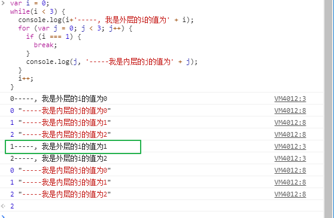

## 表达式与语句

* 两者区别
  * 表达式一般都有值，语句可能有也可能没有；
  * 语句主要为了进行某种操作，一般情况下不需要返回值；
  * 表达式是为了得到返回值，一定会返回一个值；在 `Javascript` 中，预期为值的地方都可以使用表达式。如，赋值语句的等号右边，预期是一个值，但是可以放置各种表达式；
  * **注意：表达式不需要分号结尾。表达式如果添加了分号，则 `Javascript` 会将表达式视为语句**

* 表达式举例
  * `1 + 2` 表达式的值为 `3`;
  * `add(1,2)` 表达式的值为函数的返回值；**注意：只有函数有返回值**
  * `console.log` 表达式的值为函数本身；
  * `console.log(3)` 表达式的值为 `undefined`; 因为 `console.log()` 是函数调用并没有返回；

* 语句举例

  * `let a = 1` 是一个赋值语句；

  * 语句是以分号结束的。多个语句可以写在一行内。

    ```javascript
    var a = 1 + 3; var b = 'abc';
    ```

  * 分号前面可以没有内容，`JavaScript` 引擎会把它视为空语句。

    ```js
    ;;;
    // 代表三个空语句
    ```

### 注意事项

* `Javascript` 是大小写敏感的。如： `Object` 与 `object` 是不同的；
* 大部分空格没有实际意义，写一个空格和写一堆空格一样，但是切记 `return` 后面不能加**回车**

## 标识符

标识符是用来识别各种值的合法名称。最常见的标识符就是变量名称，还有函数名称。标识符对于大小写敏感。

### 命名规则

* 第一个字符，可以是 `unicode`字母、`$` 和下划线 `_`；
* 第二个字符已经后面的字符，除了 `unicode`字母 、`$`、`_`  还可以使用数字 `0-9`;

合法标识符：

```
apple
_that
$this
π
...
```

不合法的标识符：

```js
1a // 第一个字符不能是数字
23 // 第一个字符不能是数字
*** // 标识符不能有星号
a+b // 不能包含加号
-d // 不能包含减号或者连词线
```

中文可以是合法的标识符，可以用做变量名称。


## 注释

### 什么叫注释？

> 在源代码中被 `JavaScript` 引擎忽略的部分就叫做注释，它的作用就是对代码进行解释。

`Javascript` 提供两种注释写法 : 单行注释，用 `//` 开头；第二种，多行注释， `/**/`。

```js
// 这是单行注释
/*
 这是
 多行
 注释
*/
```

### 不好的注释

* 代码翻译为中文；
* 过时的注释，代码变动之后注释并没有更新的注释；
* 发泄不满的注释；这个万万不可取；我们要做一个有职业素养的程序员；

### 好的注释

* 踩坑注解；
* 注释，「代码为何这么写？遇到的 `bug`等」

## 区块

在 `Javascript` 中使用大括号，将多个相关的语句结合在一起，称为 `区块` (block)。

如：

```js
{
    let a = 1;
    let b = 2;
    let c = 3;
}
```

区块经常跟着 `if/else/for/while` 配合使用

## 条件语句

条件语句包含 `if` 与 `switch` 用来完成条件判断，只有满足预设的条件，才会执行相应的语句。

### if 结构

```js
if(表达式) {
    语句1;
} else {
    语句2;
}
// 注意：{} 只有在语句只有一句的情况下可以省略，但是不建议这么做
```

### 特殊情况

* if 里的赋值操作


代码的原意是 当 `b` 等于 1 时就打印出第一个语句，否则打印第二个语句。但是，这时候写成赋值表达式了，结果就会将 `1` 赋值给 `b` 然后再判断 `b` 的布尔值。

这种情况会生成一个布尔值，因此程序不报错；所以在做判断时，我们需要用全等 `===` 进行判断，如下图：


* 缩进的问题

  ```js
  a = 1;
  if (a === 2) 
      console.log('a')
      console.log('a等于2')
  // 打印什么？  打印结果是 ”a等于2“，为什么呢？因为 if 后省略的 {} 只能管到一个语句，剩余的语句是正常执行的，不用满足 if 条件。
  ```

###  最推荐写法

```js
if (表达式) {
    语句
} else if (表达式) {
    语句
} else {
    语句
}

function fn(a) {
  if (a === 1) {
    return 'a 是 1'
  } 
  if (a === 2) {
    return 'a 是 2'
  }
  return 'a 是' + a
}
fn(3)
```

所有的 `{}` 都不要省略；如果是在函数中，也可用 `return` 书写，可以省略 `else if`； 

### switch 语句

`switch` 语句用来代替多个 `if...else` ，代码结构：

```js
switch(fruit) {
  case 'banana':
    // ... 执行语句
    break; 
  case 'apple':
    // ... 执行语句
    break;
  default
   // ... 执行语句
}
```

>上面代码根据变量`fruit`的值，选择执行相应的`case`。如果所有`case`都不符合，则执行最后的`default`部分。需要注意的是，每个`case`代码块内部的`break`语句不能少，否则会接下去执行下一个`case`代码块，而不是跳出`switch`结构。


如上图所示，如果不写 `break` 每一个 `case` 都会执行；

**注意：`switch` 语句后的表达式，与 `case` 语句后面的表达式比较时，采用的是严格相等的运算法 (===)，意味着比较时不会发生类型转换**

### 三元运算符

语法：`表达式1 ? 表达式2 : 表达式3`

```js
let even = (n % 2 === 0) ? true : false;
```

如果 `n` 可以被2整除，则 `even` 等于 `true` ，否则就等于 `false`。可以判断一个数是不是偶数。

三元运算符可以视为 `if...else...` 的简写形式。

### && 短路逻辑

```js
// 举例
A && B && C && D 
// 取第一个假值或者 D，并不会取 true / false
```

如图取值：


### || 短路逻辑

```js
// 举例
A || B || C || D
// 取第一个真值或D
```

如下图：


## 循环语句

循环语句用于重复执行某个操作，有以下多种形式。

### while 循环

```js
while(条件) {
  语句;
}
```

`while` 循环包含一个循环条件和一段代码块，只要条件为真，就不断循环执行代码块。

```js
let i = 0;
while(i <= 100) {
  console.log('i 当前为：' + i);
  i++;
}
```

注意：在使用 `while`时防止条件一直为真，会造成无限循环直到浏览器崩溃；如：

```js
a = 0.1;
while(a === 1) {
  console.log(a);
  a = a + 0.1;
}
// 此时的while 就是死循环， 因为存在浮点数不精确的问题
```

### for  循环

`for` 循环语法：

```javascript
for(初始化表达式; 条件; 递增表达式) {
  语句;
}
```

`for` 语句后面的括号里面，有三个表达式：

* 初始化表达式，用来确定循环变量的初始值，只在循环开始时执行一次。
* 条件表达式，每轮循环开始时，都要执行这个条件表达式，只有值为真是，才继续进行循环。
* 递增表达式，每轮循环的最后一个操作，通常用来递增循环变量；

如下示例：

```js
var length = 3;
for (var i = 0; i < length; i++) {
 console.log(i);
}
// 0
// 1
// 2
```

所有的 `for` 循环都可以用 `while` 来改写，上面的代码可以用 `while` 改写为：

```js
var length = 3;
var i = 0;
while(i < length) {
  console.log(i);
  i++; 
}
```

#### 一些比较容易迷糊的举例

```js
var length = 3;
for (var i = 0; i < length; i++) {
}
console.log(i); // 此时的i是多少？ 答案是：3， 因为 i 被循环赋值了
```

```js
var length = 3;
for (var i = 0; i < length; i++) {
  setTimeout(() => {
    console.log(i);
  }, 0);
}
// for循环会打印什么？ 答案是：打印三次3，因为 setTimeout 是你循环慢的，所以无论循环多少次在 setTimeout 时循环已经执行完毕，并赋值到最后一次；

// 优化
var length = 3;
for (var i = 0; i < length; i++) {
  ((i) => {
    setTimeout(() => {
      console.log(i);
    }, 0);
  })(i)
}

// 或者ES6写法
let length = 3;
for (let i = 0; i < length; i++) {
  setTimeout(() => {
    console.log(i);
  }, 0);
}
```

### do...while 循环

`do...while` 循环与 `while` 循环类似，唯一的区别就是先运行一次循环体，然后再判断循环条件。

```js
do {
  语句
} while(条件);
```

不管条件是否为真， `do...while` 循环至少会运行一次。注意：`while` 语句后的分号不能省略。示例：

```js
var x = 3;
var i = 0;

do {
  console.log(i);
  i++;
} while(i < x);
```

### break 与 continue

`break` 语句与 `continue` 语句都具有跳转作用，可以让代码不按既有顺序执行。

`break` 语句跳出整个代码块终止执行。

```js
var i = 0;
while(i < 100) {
  console.log(i);
  i++;
  if (i === 10) {
    break;
  }
}
```

上述代码只会执行10次循环，一旦 `i` 等于 10，就会跳出循环。

```js
var i = 0;
for(; i < 100; i++) {
  console.log(i);
  if (i === 10) {
    break;
  }
}
```

`for` 循环也可以使用 `break`。

`continue` 语句用于立即终止本次循环，返回到循环解构头部，开始下一轮循环。

```js
var i = 0;
while(i < 100) {
  console.log(i);
  i++;
  if (i % 2 === 0) {
    continue;
  }
  console.log('i 当前为：' + i);
}
```

上述代码解析为：


可以看出只有在`i`为奇数时，才会输出`i`的值。如果`i`为偶数，则直接进入下一轮循环。

**注意：如果存在多重循环，不带参数的`break`语句和`continue`语句都只针对最内层循环。**如下代码：



如上代码可以看出，只是跳出了最内层的循环，最外层的循环还是照常执行；

### 标签（label）

语法：

```js
foo: {
    console.log(1);
    break foo;
    console.log('本行不会输出');
}
console.log(2);
```

上述代码只会输出 `1`, `2`

标签可以是任意的标识符，跟标识符规则一致；

标签通常与`break`语句和`continue`语句配合使用，跳出特定的循环。

```js
top:
  for (var i = 0; i < 3; i++){
    for (var j = 0; j < 3; j++){
      if (i === 1 && j === 1) break top;
      console.log('i=' + i + ', j=' + j);
    }
  }
// i=0, j=0
// i=0, j=1
// i=0, j=2
// i=1, j=0
```

上面代码为一个双重循环区块，`break`命令后面加上了`top`标签（注意，`top`不用加引号），满足条件时，直接跳出双层循环。如果`break`语句后面不使用标签，则只能跳出内层循环，进入下一次的外层循环。

## 参考链接

* [网道 JavaScript 的基本语法](https://wangdoc.com/javascript/basic/grammar.html)

