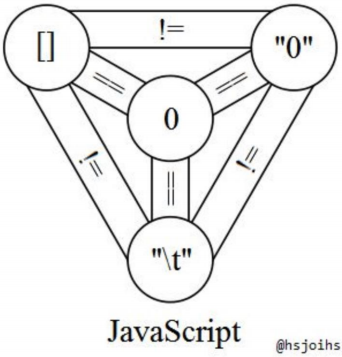
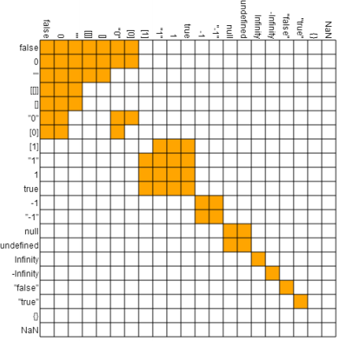
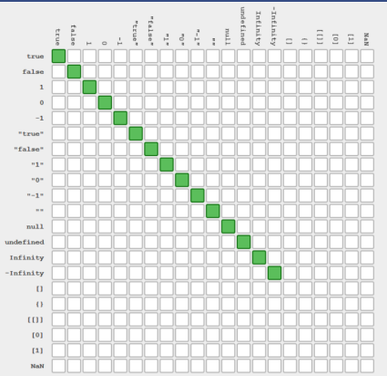

什么是运算符？

> 运算符是处理数据的基本方法，用来从现有的值得到新的值。

`JavaScript` 中提供了多种的运算符，可以分为几大部门，一起来看。

## 算数运算符

>  `JavaScript` 供提供了10个算术运算符，用来完成基本的算术运算。说白了算术运算符跟我们平时做的数学运算一样。

### number 运算

* 加减乘除运算符，跟数学里的一样，不过是用 `*` 来代替 乘号，用 `/` 来代替除号。

  ```js
  1 + 1 //  2 
  2 - 1 // 1
  3 * 2 // 6
  6 / 3 // 2
  ```

* 余数运算符，在 `JS` 中用 `%` 号表示取余。值得注意的是，在 `JS` 中负数也可以做取余运算。也就是说运算结果的正负号是由第一个运算值的正负号来决定的。

  ```js
  1 % 2 // 1
  2 % 2 // 0
  2 % 3 // 2
  3 % 7 // 3
  -1 % 3 // -1
  1 % -2 // 1
  ```

* 指数运算符，用`**` 表示。指数的意思就是 2 的 4 次方 4 就是指数，2 就是底数。

  ```js
  2 ** 4 // 16
  10 ** 2 // 100
  ```

  注意：当多个运算符链接在一起时，先进行右边的计算，然后再最后算值。

  ```js
  2 ** 3 ** 2 // 512 相当于 2 ** (3 ** 2)
  ```

* 自增（`x++/++x`）、自减（`x--/++x`）运算符。

  ```js
  let a = 1
  let b = a++
  console.log(b) // 10
  
  let a = 1
  let b = ++a
  console.log(b) // 11
  
  // 得出结论，如果a在前，值为前，a在后，值为后
  ```

* 求值运算符 `+x` 表示 + 号后跟任何值都是求值。

  ```js
  let c = -1
  +c // -1 ,并不是求正数
  ```

* 负数运算符 `-x` 就是我们理解的数学的负数。

  ```js
  let c = -1
  -c // 1, 负负得正
  let d = 1
  -d // -1 变为负数
  ```

### string 运算

* 连接运算 `+`

  ```js
  '123' + '456' // '123456'
  1 + '2' // '12'
  ```

注意：在工作中，少用 `++` 或者 `--` 操作，因为这样可能会搞混，尽量使用 `+=1` 或 `-=1` 代替。 

## 比较运算符

> 比较运算符用于比较两个值的大小，然后返回一个布尔值，表示是否满足指定的条件。

`JavaScript` 提供了8个比较运算符。

* `>` 大于运算符。
* `<` 小于运算符。
* `<=` 小于等于运算符。
* `>=` 大于等于运算符。
* `==` 模糊相等运算符。
* `===` 严格相等运算符。
* `!=` 不相等运算符。
* `!==` 严格不相等运算符。

### 重点 `==` 与 `===` 运算符

先上一张图:



从图上可以得出：

```js
[] == 0 // true
'0' == 0 // true
'\t' == 0 // true

// 但是
[] == '/t' // false
[] == '0' // false
'0' == '/t' // false
```

是不是感觉很奇怪，这就是 `JS` 的神奇之处。所以，在平时的开发工作中一定记得用 `===` 代替 `==` 。因为 `==` 总是会进行自动的类型转换。

由于 `==` 在 `JS` 中的不可确定性，所以会造成让你意想不到的值，如下图：

上图中，黄色的代表是真，白色的代表是假。这是在用 `==` 号的前提下。

`[] == false` 可以得到的结果是 `true` 。但是 `[]` 并非 `falsy` 值。因为 `falsy` 只有5个，分别是 `'' null undefined 0 false`。按道理说如果 `[]== false` 那么`[]`应该就是 `falsy`值啊，可惜它不是这就是 `JS` 的匪夷之处。

还有：`[[]] == false`。所以在用 `==` 时会有意向不到的情况等着你，接下来看看 `===` 还是一张图：



`===` 遵循以下两条规则：

* 基本类型看值是否相等。

* 对象类型看地址是否相等。

  ``` js
  [] !== [] // true  因为地址不相等
  {} !== {} // true 
  ```

**注意：`NaN !== NaN` 这是唯一特例。** 

## 布尔运算符

布尔运算符包含，或且非 （|| && ！）也可以把三元运算符也算在里面（?:）。

### `!` 运算符

非布尔值，取反运算符会将其转化为布尔值。以下六个值取反后为 `true`，其他值都为 `false`。

* `undefined`。
* `null`。
* `false`。
* `0`。
* `NaN`。
* 空字符串 `''`。

```js
!undefined // true
!null // true
!0 // true
!NaN // true
!"" // true

!54 // false
!'hello' // false
!{} // false
![] // false
```

### `&&` 运算符

运算规则：如果第一个运算子的布尔值为 `true` ,则返回第二个运算子的值（是值，不是布尔值）；如果第一个运算子的布尔值为 `false`,则直接返回第一个运算子的值，且不再对第二个运算子求值。

```js
'a' && '' // ''
'a' && 'b' // 'b'
'' && 'b' // ''

let a = 1
(1 - 1) && (a += 1) // 0, 因为 1 - 1 是0 0是false，则返回第一个的值
a // 1
```

`&&` 也可称为短路逻辑。

且运算符可以多个连用，这时返回的第一个布尔值为 `false` 的表达式的值。如果所有表达式的布尔值都为 `true` 则返回最后一个表达式的值。

```js
true && 'foo' && '' && 4 && 'foo' && true // ''
1 && 2 && 3 // 3
```

## `||` 运算符

运算规则：如果第一个运算子的布尔值是 `true` ，则返回第一个运算子的值，且不会再对第二个运算子求值。如果第一个运算子的布尔值为 `false`,则返回第二个运算子的值。

``` js
'a' || 'b' // 'a'
'a' || '' // 'a'
'' || 1 // 1
'' || '' // ''
```

在 `ES6` 之前如果想给一个函数参数默认值，通常也会使用 `||`。

```js
function add(n) {
   n = n || 0
   return n + 1
}
add() // 1, 在不传参数时，也不会造成错误

// es6 后的写法
function add(n = 0) {
  return n + 1
}
```

## 二进制位运算符

二进制位运算符用于直接对二进制位进行计算。可以分为以下几个方面：

* **二进制或运算符**，符号 `|` , 表示若两个二进制位都为 `0` 则结果为 `0`, 否则为 `1`。具体是什么意思呢？`|` 两边的运算子逐位比较，两个进制位之中只要有一个为 `1`, 就返回 `1`, 否则返回  `0`。

  ```js
  (0b0011 | 0b1111).toString(2); // "1111" 
  ```

* **二进制与运算符**，符号 `&` 的规则是逐位比较两个运算子，两个二进制位之中只要有一个位为 `0` ,就返回 `0`, 否则返回 `1`。

  ```js
  (0b0011 & 0b1111).toString(2); // "0011" 
  (0b1010 & 0b1111).toString(2); // "1010"
  ```

* **二进制否运算符**，符号 `~` 将每个二进制位都变为相反值（`0` 变为 `1`, `1` 变为 `0`）。

  ```js
  ~3 // -4
  ```

  上述的结果为什么是 `-4` 。因为 `JS` 内部会将所有的运算子都转为 32 位的二进制数整数再进行的运算。由于内部过程相对比较复杂，这里就不做展开，可以记住一个公式即可： `一个数与自身的取反值相加，等于 -1` 。举例：

  ```js
  ~ -3 // 2
  // 套用公式，-3的取反值记作 x - （-3） = -1 得出结果位2
  ```

  对一个整数连续两次二进制取反运算，得到的是他本身。

  ```js
  ~~3 // 3
  ~~-3 // -3
  ```

  二进制取反还可用作小数取整，因为位运算符只对整数有效。遇到小数会把小数舍弃，只保留整数部分。所以，对一个小数连续进行两次二进制否运算，可以达到取整的效果。

  ```js
  ~~2.9 // 2
  ~~47.11 // 47
  ~~-1.999 // -1
  ```

  注意：**使用二进制否运算取整，是所有取整方法里最快的一种。**

* **二进制异或运算符**，符号 `^` 在两个二进制不同时返回 `1` ,相同时返回 `0`。

  ```js
  (0b0011 ^ 0b1111).toString(2); // 1100
  // 相同返回 0 不同返回 1
  ```

  异或运算有一个特殊的运用，连续对两个数 `a` 和 `b` 进行三次异或运算，可以互换它们的值。这意味着，使用异或运算可以在不引入临时变量的前提下，互换两个变量的值。

  ```js
  var a = 5
  var b = 8
  a ^= b
  b ^= a
  a ^= b
  console.log(a) // 8
  console.log(b) // 5
  // 这是互换两个变量值最快的方法。
  ```

* **右移运算符** ，符号 `>>` 表示，表示将一个数的二进制值向右移动指定的位数。如果是正数，头部全部补 `0`; 如果是负数，头部全部补 `1`。右移运算符基本上相当于是除以 `2` 的指定次方。

  ```js
  0b0010 >> 1 // 0001，0 可以忽略不计所以为1
  4 >> 1 // 2 可以理解为 4除以2的1次方，也就是 4/2 = 2
  -4 >> 1 // -4/2 = -2
  ```

* **左移运算符**, 符号 `<<` 表示，表示将一个数的二进制向左移动指定的位数，尾部补零。左移运算符可以相当于是乘以`2`的指定次方。

  如果左移0位，等同于取整。

  ```js
  4 << 1 // 8 4的二进制是100，左移一位是1000，转换为十进制则是8，相当于乘以2的一次方。
  -4 << 1 // -4*2=-8
  
  13.5 << 0 // 13
  -13.5 << 0 // -13
  ```

### 位运算一些小技巧

* 使用与运算符判断奇数和偶数

```js
偶数 & 1 = 0 
奇数 & 1 = 1
```

* 使用 ~,>>, <<, >>>,  | 取整

```js
console.log(~~6.83) // 6
console.log(6.83 >> 0) // 6
console.log(6.83 << 0) // 6
console.log(6.83 | 0) // 6
```

* 交换 a, b 值

```js
var a = 5
var b = 8
a ^= b
b ^= a
a ^= b
console.log(a) // 8
console.log(b) // 5
```

## 点运算符

* 语法：`对象.属性名 = 属性值` 。
* 作用：读取对象的属性值。

### 反问，如果不是对象为什么也可以有属性值？

```js 
`a,b,c`.splict(',') // ['a', 'b', 'c']
```

### 答：

* `JS` 内部会做自己的处理，如果`.` 前面不是对象，就把它封装成对象。
* `number` 会变为 `Number` 对象。
* `string` 会变为 `String` 对象。
* `bool` 会变为 `Boolean` 对象。

## void 运算符

`void` 运算符的作用是执行一个表达式，然后返回 `undefined`。

```js
void 0 // undefined
void console.log(1) // 1 undefined
void (1+2) // undefined
```

`void` 运算符的主要用途是超链接中插入代码防止网页跳转。

```html
<script>
  function f(){
    console.log(12122)
  }
</script>
<a href="javascript: void()">跳转</a>
```

## 逗号运算符

逗号运算符用于对两个表达式求值，并返回后一个表达式的值。

```js
'a', 'b' // 'b'
var x = 0
var y = (x++, 10)
console.log(x) // 1
console.log(y) // 10
```

逗号运算符的一个重要用途是，在返回一个值之前，进行辅助操作。

```js
let fn = (a) => (console.log('求值'), a + 1)
fn(1) // 先打印求值，然后再打印 1 注意：括号不能省略
```

## 运算符优先级

优先级的意思就是先算什么然后再算什么。如下代码：

```js
4 + 5 * 6  // 34 先算乘法再算加法因为乘法比加法运算符优先级高
```

运算符的优先级别十分复杂，而且都是硬性规定的。如果实在无法记忆，则可以只记住一点即可 **圆括号运算符是最高的，我们要一直使用圆括号运算符**。

[运算符优先级汇总表](https://developer.mozilla.org/zh-CN/docs/Web/JavaScript/Reference/Operators/Operator_Precedence#Table) 通过链接可以看到，运算符真的很难记忆，所以在工作中是一直推荐使用**圆括号**来提高运算符的优先级。

## 后记

这节课重点学习了各种运算符，可以看到大多数都是得死记硬背而且容易遗忘，还特别容易搞混，所以这节课带给我的启示就是两条：

* 在工作中一直使用 `===` 进行对比。
* 在工作中一直使用 `()` 进行运算符优先级计算。

## 参考资料

[网道教程-运算符](https://wangdoc.com/javascript/operators/index.html)


 

