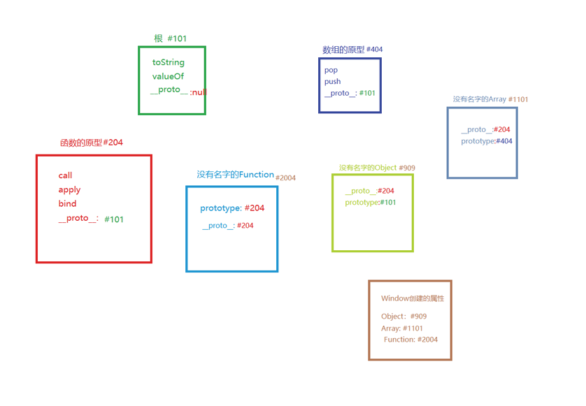

`JS` 原型作为 `JS` 世界中的三座大山之一，如果要搞明白的话着实是要费一些劲的。因为它存在了很多概念，这些概念又来回颠倒，所以导致我们傻傻分不清楚。那么这篇文章就是从新整理原型的知识，方便之后反复来读写。因为 `JS` 是复杂的，就是需要反反复复的学习，并且需要结合实践来学习。话不多说，开始走进原型的世界。

##  三大知识点

### `JS`  中的唯一公式

```js
对象.__proto__ === 其构造函数.prototype
```

### 根公理

```js
Object.prototype 是所有对象的（直接或间接）原型
```

这是 `JS` 中的公理，就是在 `JS` 创建的时候就采用了这个说法。必须牢记于心。

### 函数公理

* **所有函数都是由 `Function` 构造的**；
* 如果结合第一个公式则会推出： `任何函数.__proto__ === Function.prototype`;
* 任何函数包括：`Object` /  `Array` / `Function`;

**结论：基于以上的三大知识点和基础知识就构成了整个的 `JS` 世界**。

## 带着问题来消化

* 以下代码中对象的原型是什么意思？

  ```js
  1. {name: 'jacky'} 的原型
  2. [1, 2, 3] 的原型
  3. Object 的原型
  ```

  解读：

  **`Object` 的原型是 `Object.__prototype`** 而并不是 `Object.prototype`，为什么？

  当在问到某一个对象 「的原型」时，约定的 `对象.__proto__`。

* 如果 `[1, 2, 3].__proto__ === Array.prototype` 那么数组是一个对象，根据**根公理** `Object.prototype` 是所有对象的原型？那上述的代码就不应该成立吧？其实原因如下：
  * 原型分为直接原型和间接原型；
  * `Object.prototype` 是数组对象和函数对象的间接原型；是普通对象的直接原型
  * `Array.prototype` 的数组对象的直接原型；

* `Object.prototype` 是所有对象的原型；`Object` 是 `Function` 构造出来的；所以 `Function` 构造了 `Object.prototype` 得出推论， `Function` 才是万物之源啊？上述我们也说了根公理不容置疑，既然置疑了，就来 ”打破“ 置疑，原因如下：
  * `Object.prototype` 和 `Object.prototype` 对象的区别。`Object.prototype` 指向了一个地址，而这个地址里的属性组成了对象也就是 `Object.prototype` 对象。

## 从新认识JS世界

一个草草的内存图了解一下：



解析上图，来了解`JS` 世界的构造顺序：

* 创建根对象 `#101` ,此时根对象没有名字；
* 创建 `函数的原型 #204`， 函数原型 `__proto__` 为 `#101`;
* 创建 `数组的原型 #404` ，数组原型 `__proto__` 为 `#101`;
* 创建 `Function #2004` 原型 `__proto__` 为 `#204`; 
* 让 `Function.prototype` 等于 `#204`;
* 用 `Function` 创建 `Object`;
* 让 `Object.prototype` 等于 `#101` ;
* 用 `Function` 创建 `Array`;
* 让 `Array.prototype` 等于 `#404`;
* 创建 `window` 对象；
* 用 `window` 的 `Object` 和  `Array` 属性分别为 `Function ` 创造出来的 `Object` 和 `Array` 命名。