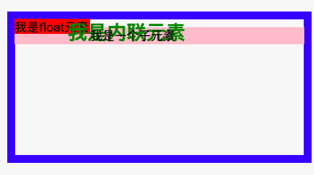

## 前言

思考一个小问题，布局与定位的区别？

我们可能认为布局里面也是包含定位的，因为布局时一个个小模块组合在一块的，而定位也是把一个模块通过定位的方式放在一个模块里。其实不然，**布局是相对于屏幕平面上的，而定位是垂直于屏幕上的。** 那么这是什么意思呢？里面有涉及哪些概念呢？下面一起看看吧！

## div的分层

之前我们有提到过盒模型的概念，如下图：

假如给内容区一个背景，那么背景的范围是从哪里开始的呢？通过一个 [验证demo](https://jsbin.com/givazajuye/2/edit?html,css,output) 可以得出背景色的区域是 `border` 外边沿围城的区域。那么通过这个例子可以知道一个模块的背景色是低于一个模块的 `border` 的，模块的具体分层是什么样子呢？如下图所示：

从上图例子可以看出来，一个模块的分层是从下往上的是 `background`、`border` 、`块级子元素`、`浮动元素` 、`内联元素`。可以通过 [在线demo](https://jsbin.com/hinariqiha/2/edit?html,css,output) 进行验证。验证图如下：

**注意：文字模块，如果是后写的层级是会覆盖前者的，不管是 `浮动元素` 还是 `内联元素`。**

## 定位 position

* `static` 默认值，当前元素在文档流中；
* `relative` 相对定位，元素也是在文档流之内，可以通过设置 `top/right/bottom/left` 值进行位置的偏移，但是始终是占据着文档流的，一般作为 `absolute` 的父级使用。
* `absolute` 绝对定位，脱离文档流，使用场景，比如：对话框、比如二级导航等，`absolute` 是相对于祖先元素中最近的**定位元素（除样式是`static`以外的元素）**。在使用绝对定位时，一定要给父级添加上 `relative` ；
* `fixed` 相对于视口进行定位，如：回到顶部按钮、网页右侧固定广告栏等；移动端上尽量不要使用`fixed` ，场景：如果给元素添加 `transform:scale(1.1)` 那么就不会相对于视口定位。

注意：定位元素可以添加 `z-index` 来确定定位元素的层级，`z-index` 的默认值是 `auto` 可以设置为正整数和负整数以及 `0` ；

## 层叠上下文

根据 `div` 的分层，以及定位元素，可以得出一个新的东西（层叠上下文），如下图：

1. 层叠上下文也叫堆叠上下文；

2. 每一个层叠上下文就是一个新的「小世界」（作用域）
3. 这个「小世界」的`z-index`跟外界的无关；
4. 处在同一个世界里的 `z-index` 才能够进行比较；

### 哪些属性可以创建层叠上下文

* 根元素(HTML);
* `z-index` 不为 `auto` 的相对/绝对定位；
* 父元素为 `flex` ;
* `opacity` 不为1；
* `position:fixed` 固定定位

 更多请查看 [MDN 层叠上下文](https://developer.mozilla.org/zh-CN/docs/Web/Guide/CSS/Understanding_z_index/The_stacking_context)

 注意：负 `z-index` 是逃不出层叠上下文的，如果父级中存在了层叠上下文，那么负的 `z-index` 是脱离不了这个元素的。

