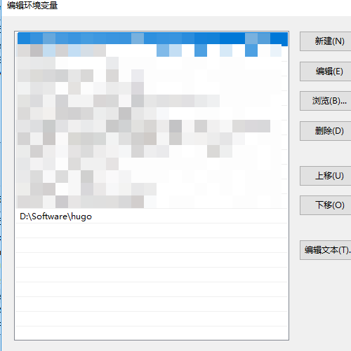

`hugo` 是一种静态网站生成器。非常适合搭建个人静态博客。因为 `hugo` 的生成速度很快，不管是运行还是打包，所以将个人的博客用 `hugo` 搭建是非常不错的选择。

使用 `hugo` 搭建并部署在 `github` 上的个人博客：[https://jinchao1992.github.io](https://jinchao1992.github.io)

## 安装hugo

[官方教程](https://gohugo.io/getting-started/installing)

###  `Mac`安装方式

`brew install hugo `

`Window` 安装方式

* 前往 [Hugo releases](https://github.com/gohugoio/hugo/releases) 页面下载 `hugo_xxx_Windows-64bit.zip` 其中 `xxx` 是指的版本号

* 在硬盘中创建安装目录，例如：`D:\Hugo`，把压缩包解压，并加入到 `PATH` 中，如下图：

  

* 在终端中运行 `hugo version` 查看 `hugo版本`，如果看到有 如下字样：`Hugo Static Site Generator v0.58.0-64D8BF1E windows/amd64 BuildDate: 2019-09-04T15:43:46Z` 代表 `hugo` 安装成功

##  快速搭建个人博客

* 进入 [Hugo](https://gohugo.io/) 官网， 点击 `Quick Start` 按钮快速开始；
* 总共有 7 个步骤，从第二个步骤开始一步步操作即可，这里就不一一阐述啦；

### 新建博客文章

```
hugo new post/文章名称.md 
```

### 启动 Hugo

```
hugo server -D
```

## hugo 主题安装

`hugo` 官网有很多好看的主题，可以自行选择你比较喜欢的主题 [Themes](https://themes.gohugo.io/)。

选择了比较好看的一款 [hugo-tranquilpeak-theme](https://themes.gohugo.io/hugo-tranquilpeak-theme/) 。 安装配置过程如下：

* 由于在之前的 `hugo` 安装过程中已经创建了 `themes` 目录直接运行一下命令即可：

  ```
  cd themes
  git clone https://github.com/kakawait/hugo-tranquilpeak-theme.git
  ```

* 打开 `config.toml` 配置文件，进行主题配置。[我的配置文件](https://github.com/jinchao1992/hugo-blog/blob/master/config.toml)

注意：配置完成后，一定记得把封面图、头像图片拷贝到 `static/images` 目录下。

##  发布网站到 GitHub Pages

为了部署上线，首先需要将 `Markdown` 文件打包成 `HTML` 文件

* 运行命令

  ```
  hugo
  ```

* 本地会生成一个 `public` 目录，此目录名字可以修改，在 `config.toml` 中 修改`publishDir` 即可。

* 在 `GitHub` 新建一个 `Repository` 命名为 `xxx.github.io` ,其中 `xxx` 需要改为自己的 `GitHub` 账户名称。

* 进入 `public` 目录里执行如下命令： 

  ```
  git init
  git add .
  git commit -m "commit message"
  git remote add origin git@github.com:xxx/xxx.github.io.git
  git push -u origin master
  ```

* 完成上述命令后，等待一段时间即可在 `https://xxx.github.io/` 访问到刚才部署的内容。
* 之后再更新文章，只需从新生成 `public` 目录 `push` 到远程目录即可。

