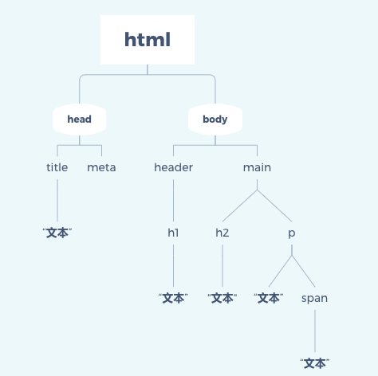
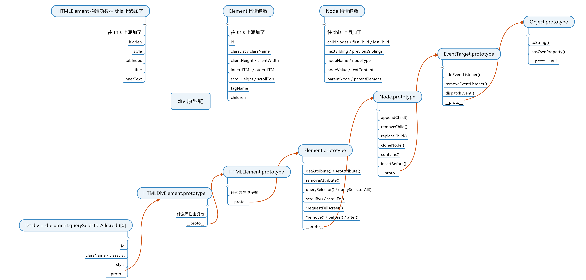
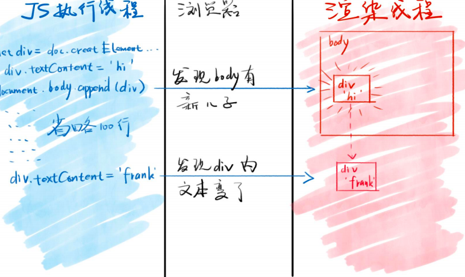

DOM 是什么？DOM （Document Object Model）中文名称为文档对象模型。JS 用 document 来操作网页，这种模式就叫做 DOM 操作。

## DOM 树

什么是 DOM 树？

> 一个文档的所有节点，按照所在的层级，可以抽象成一种树状的结构，这种结构就是 DOM 树。

DOM 树有一个顶层的节点，下一层都是顶层节点的子节点，然后子节点又有自己的子节点，就这样层层衍生出一个金字塔结构，倒过来就像是一个课树了。如下图：



## JavaScript 如何操作DOM树

在 `JavaScript` 中是通过 `document` 来操作整个 DOM 树的，`document` 是由浏览器提供给 `JS` 使用的。

接下来我们通过一些 `API` 来认识一下 `DOM` 操作。

### 获取元素

* `window.idxxx` 直接获取一个id为xxx 的元素。
* `document.getElementById('xxx')` 获取 id 为 `xxx` 的元素。
* `document.getElementsByTagName('div')` 获取所有 `div` 元素，注意这里获取的是一个伪数组。
* `document.getElementsByClassName('red')` 获取所有 `class` 包含 `red` 的元素。这里获取的也是一个伪数组。
* `document.querySelector('#xxx')` 获取 id 为 `xxx` 的元素，注意跟上述获取id的做出区分。这里最关键的是括号里面可以写 `CSS` 选择器，非常强大。 
* `document.querySelectorAll('.red')` 获取所有 `class` 包含 `red` 的元素。这里获取的也是一个伪数组。

在工作中尽量使用 `document.querySelector` 与 `document.querySelectorAll` 这两个来获取 DOM 元素。

### 获取特定的元素

* `document.documentElement` 获取 `html` 元素。
* `document.head` 获取 `head` 元素。
* `document.body` 获取 `body` 元素。
* `window` 获取窗口。
* `document.all` 获取所有元素。虽然能获取到所有元素，但是它是第六个 `Falsy` 值，前五个为： `false NaN undefined '' 0`。

### 获取到的元素是什么？

我们通过上述的 `API` 可以获取到 DOM 元素，那么我们获取到的元素是什么呢？答案是：获取到的元素也是对象。假如我们在页面上获取了一个 `DIV` 元素，那么它的原型链如下：

* 第一层原型， `HTMLDivElement.prototype`这里面存放的是所有 div 属性。
* 第二层原型，`HTMLElement.prototype` 这里面是所有 `HTML` 标签共有的属性。
* 第三层原型，`Element.prototype` 这里面是所有 `XML` 、`HTML` 标签的共有属性。
* 第四层原型，`Node.prototype` 这里面是所有节点的共有属性，节点包含 `HTML ` 文本、注释以及XML 文本等。
* 第五层原型，`EventTarget.prototype`，最重要的属性是 `addEventListener` 是用来处理事件的。
* 最后一层是所有对象 `Object.prototype`。

图解：



### 什么是节点？什么是元素？

节点包含，元素、注释、文本等。使用 `x.nodeType` 获取节点的类型，1 代表元素，3 代表文本。更多请参考：[MDN 节点](https://developer.mozilla.org/zh-CN/docs/Web/API/Node/nodeType)。

接下来我们看看 `JS` 对 节点是如何增删改查的。

#### 添加

* 创建一个标签节点。

  ```js
  let div1 = document.createElement('div')
  ```

* 创建一个文本节点。

  ```js
  let text1 = document.createTextNode("你好")
  ```

* 标签里插入文本。

  ```js
  div1.appendChild(text1)
  div1.innerText = '你好'
  div1.contenText = '你好'
  ```

注意：如果我们创建了一个元素，并没有插入到页面中，它是不会生效的，必须插入到head 或者 body里，因为默认是存在 `JS` 线程中。

```js
let div1 = document.createElement('div')
document.head.appendChild('div1')
document.body.appendChild('div1')

// 只会插入到 body 中 并不会即插入到 head 中 又插入到 body中
```

如果想在两个地方插入同一个元素的，则需要进行克隆。

```js
let div1 = document.createElement('div')
let div2 = div1.cloneNode(true) // true 代表深克隆
document.head.appendChild('div2')
document.body.appendChild('div1')
```

#### 删除

* 第一种：

  ```js
  div1.parentNode.removeChild(div1)* 
  ```

* 第二种，IE 不支持

  ```js
  div1.remove()
  ```

注意： 如果一个节点被移除了，那么它是可以被再加回来的，因为它只是被移除 DOM 树，但是还是存在内存中。

#### 修改

修改属性：

* 修改 `class`  。

  ```
  div.className = "red blue"
  div.classList.add('red')
  ```

* 修改 `style` 。

  ```js
  div.style = "position:absolute; top: 10px; left: 20px;"
  div.style.position = "relative"
  div.style.backgroundColor = "red"
  ```

* 修改 `data` 属性。

  ```js
  div.dataset = "aaa"
  ```

读属性：

```js
div.classList // 读取class名称
div.getAttribute('class') // 可以获取所有属性
```

修改事件处理函数:

`div.onclick = fn` 后发生了什么操作？

* 默认点击 div 不会有任何效果。
* 如果把 `div.onclick` 改为函数 `fn`。
* 那么点击 `div` 的时候，浏览器就会调用这个函数。且调用的方式为 `fn.call(div, event)` 把 `this` 指向当前的事件元素，第一个参数为事件对象。

修改内容：

* 修改文本内容：

  ```js
  div.innerText = 'xxx'
  div.textContent = 'xxx'
  ```

* 修改 HTML 内容：

  ```js
  div.innerHTML = "<span>1221</span>"
  ```

* 改标签：

  ```js
  div.innerHTML = '' // 先清空
  div.appendChild(div2) // 然后再添加
  ```

#### 查询

* 查父元素：

* ```js
  node.parentNode // 查所有节点
  node.parentElement // 查元素节点
  ```

* 查爷爷元素：

* ```js
  node.parentNode.parentNode
  ```

* 查子节点：

* ```js
  node.childNodes // 查询所有节点
  node.children // 查询元素节点
  ```

* 查兄弟姐妹:

  ```js
  node.parentNode.childrenNodes // 排除本身
  node.parentNode.children // 排除本身
  ```

* 查看第一个节点：

* ```
  node.firstChild
  ```

* 查看最后一个节点：

* ```
  node.lastChild
  ```

* 查看上一个节点

* ```js
  node.previousSibling 
  // 或者
  node.previousElementSibling
  ```

* 查看下一个节点：

  ```js
  node.nextSibling
  // 或者
  node.nextElementSibling
  ```

* 如何遍历一个元素里的所有子节点。

  ```js
  let travel = (node, fn) => {
    fn(node)
    if (node.children) {
      for (let i = 0; i < node.children.length; i++) {
        travel(node.children[i], fn)
      }
    }
  }
  
  travel(div1, (node) => {
    console.log(node)
  })
  ```

## DOM 操作为什么是跨线程的

浏览器里分为**JS引擎** 和**渲染引擎**。两个引擎各司其职，JS 引擎不能操作页面，渲染引擎不能操作 JS 。那么又是如何把元素插入到页面当中的呢？

### 跨线程通信

当浏览器发现 JS 在 body 里面增加了一个 div 对象时，浏览器会通知渲染引擎在页面上新增一个 div 元素，新增的 div 元素所有的属性都会照抄所创建的 div 元素。

图示：



如果我们已经把创建的元素放入到页面中了，如果我们对创建的元素进行修改的操作，可能会触发重新渲染。如：

* `div.id = "newId"` 如果新的 ID 有一些样式的变化，那么肯定会进行重新渲染。

* ```html
  <div title="hi"></div>
  <style>
    div::after {
      content: attr(title)
    }
  </style>
  <script>
    div.title = "hello"
  </script>
  <!--
   上述的代码势必会引起重新渲染，因为内容修改了
  -->
  ```

* 对 div 的操作有可能会被合并，如下例子：

  ```html
  <div id="demo1"></div>
  
  <style>
    .start {
      width: 100px;
      height: 100px;
      border: 1px solid red;
      transition: all .5s;
    }
    .end {
      width: 200px;
    }
  </style>
  
  <script>
  	demo1.classList.add('start')
    // demo1.clientWidth
  	demo1.classList.add('end')
    // 这里就是由于浏览器对于js的操作进行了合并
  </script>
  
  ```

### 线程的属性同步

在JS中修改元素的属性，是否会被浏览器同步呢？也就是说是否会在渲染引擎中显示呢！遵循以下原则：

* 如果是标准属性，如：id 、className title 等，是一定会被同步过去的。
* 如果是自定义属性 `data-*` 则也是可以被同步过去。
* 如果是非标准属性，只会停留在 JS 引擎中是不会同步渲染到浏览器中的。

结论：如果是自定义属性，又想同步到浏览器中则需要使用 `data-`来书写。

## 后记

DOM 很难用，但是我们也要学会常用的 DOM 操作，因为 JQuery 曾经垄断了前端好多年，JQuery 中最常见的就是 DOM 操作了。所以学会了 DOM 操作，我们也可以看看 JQuery 中对于 DOM 操作的封装了。