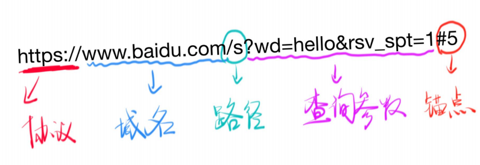
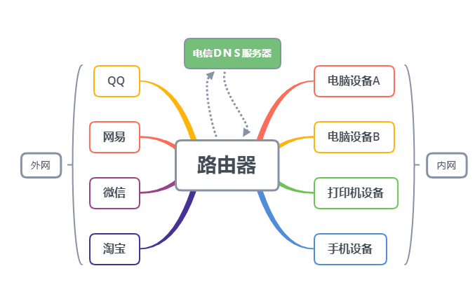
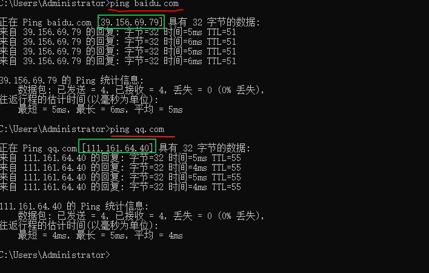
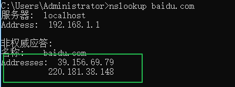

## 前言

URL（Uniform Resource Locator）统一资源定位符。由 [蒂姆·伯纳斯-李](https://zh.wikipedia.org/wiki/蒂姆·伯纳斯-李) 发明。它包含以下几个方面：

* 传送协议；
* 域名或IP；
* 端口；
* 路径；
* 查询参数；
* 锚点；

示例图：

上述的这几个词都代表什么呢？一起来看一下吧！

## IP与域名

什么是 `IP` ？ IP（**I**nternet **P**rotocol） 中文名，互联网协议，主要做两件事情：

1. 定位一台设备；

2. 封装数据报文，与其他设备交流；

每一个在互联网中的用户都是有一个 `IP` 而 `IP` 又可分为 `内网IP` 与 `外网IP`， 如下图：

`内网`与`外网` 通过路由器相隔开，内网不能直接访问外网。

外网IP是由电信服务器负责分配，路由器链接电信服务器，如果我们重新启动路由器，外网IP也有可能被更改。当然也可以固定外网IP只是比较贵；

内网IP是路由器分配给设备的地址，如：`192.168.1.1`；

可以通过 http://ip38.com/ 定位IP具体地址。

### 路由器功能

* 路由器链接内网与外网；
* 内网设备可以互相访问，内网设备访问外网必须通过路由器；
* 外网设备可以互相访问，但是不能访问内网；
* 外网设备发送内网内容也需通过路由器；

### 特殊的IP

* `127.0.0.1` 表示本机，如：本地搭建的服务器；
* `localhost` 通过 `host` 指定的自己；
  * `host` 可以指定本地域名，如：`127.0.0.1 jinchao1992` 那么就可以直接访问 `jinchao1992`;
  * `windows` `host` 文件位置：`C:\Windows\System32\drivers\etc\hosts`;
  * ` macOS / Linux` `hosts 位于 /etc/hosts`；

### 域名

域名就是对IP的别称，可以通过 `ping` 命令来查询当前域名的 `IP`  如下图：

 

上述截图可以看出来，通过 `ping` 命令得到了 `baidu.com` 与 `qq.com` 的 `IP` 地址，当然它们的 `IP` 肯定不会采用了一个，原因如下：

* 一个域名可以对应不同的 `IP `  用来做负载均衡，防止一台服务器扛不住多人次的访问；
* 一个 `IP` 可以对应不同的域名这个叫做共享主机；

那么域名和 `IP` 是如何对应起来的呢？答案是通过 `DNS(Domain Name System)` 域名系统；

#### 域名等级

* `com、cn等` 顶级域名
* `baidu.com` 二级域名
* `www.baidu.com` 三级域名  

注意：`www.baidu.com` 与 `baidu.com` 是两个不同的域名，只不过都被指向了同一个地址。

#### nslookup

**nslookup命令**是常用域名查询工具，就是查DNS信息用的命令。如：`nslookup baidu.com` 解析结果如下：

绿色框住的就是百度的DNS解析地址；

#### 输入网址后发生了什么？

> 当在浏览器输入网址后，浏览器会向电线/联通/移动提供的 DNS 服务器，询问网址对应的IP；
>
> 电信/联通/移动会相应一个IP，当然这其中的步骤是很麻烦的；
>
> 浏览器向对应的IP的**80**或者**443**端口发送请求；
>
> 请求的内容是查看网址的首页；

## 端口

端口是什么？一台服务器可以提供很多服务，每一个服务都对应一个号码，这个号码就是端口；端口总共 `65535` 个；

### 常用端口：

* HTTP 服务使用 `80` 端口；
* HTTPS 服务使用 `443` 端口；
* FTP 服务使用 `21` 端口；

### 端口使用规则

* `0` 到 `1023` 号端口留给系统使用，只有拥有管理员权限，才能使用这 `1024` 个端口；
* 其余的端口可以分配给用户使用；
* 我们一般开发网页使用的是 `8888` 与 `8080` 端口；
* 如果端口号被占用，只能换其他端口，两个端口不能共存；

**记住一句话，上网必须拥有IP和端口两者缺一不可。**

## 路径

路径的意思是，我们可以通过不同的网址路径访问不同的页面，如：

* https://developer.mozilla.org/zh-CN/docs/Web/HTML
* https://developer.mozilla.org/zh-CN/docs/Web/css

上述的路径是: `/zh-CN/docs/Web/HTML 与 /zh-CN/docs/Web/css`  可以看出来不同的路径看到的网页内容是有所不同的；

问题：那如果是同一个页面呢，想看到不同的内容怎么办？答案：通过查询参数！

## 查询参数

如下网址：

* https://www.baidu.com/s?wd=hi
* https://www.baidu.com/s?wd=hello

访问百度同一个路径 `/s` 代表搜索 `wd=hi` 与 `wd=hello` 代表不同的查询参数，得到的网页是不同的；所以同一个页面可以用不同的查询参数显示不同的内容；

问题：那同一个页面，同一个内容，不同的位置如何访问？答案：可以通过锚点

## 锚点

如下网址：

* [https://developer.mozilla.org/zh-CN/docs/Web/css#%E5%8F%82%E8%80%83%E4%B9%A6](https://developer.mozilla.org/zh-CN/docs/Web/css#参考书)
* [https://developer.mozilla.org/zh-CN/docs/Web/css#CSS_%E5%BC%80%E5%8F%91%E5%B7%A5%E5%85%B7](https://developer.mozilla.org/zh-CN/docs/Web/css#CSS_开发工具)

上述网址同一个页面同一个内容，不同的位置可以通过不同的锚点进行设置。

**注意：锚点不支持中文，中文会被解析为一段码，锚点不会传给服务器。**